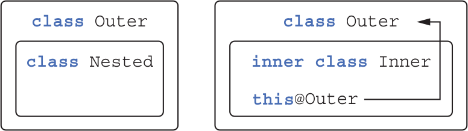

# ___Kotlin___ 👃❌

📖 `kotlin in action`

🔗 <https://www.manning.com/books/kotlin-in-action>

🔗 <https://try.kotlinlang.org>

🔗 <https://www.acornpub.co.kr/book/kotlin-in-action>

# 코틀린은 무엇인가? 

코틀린은 JVM, Android, JavaScript and Native를 대상으로 JetBrains에서 개발한 OSS 정적 타입 프로그래밍 언어다.  
코틀린은 __간결__ 하고 __실용적__ 이며, 자바 코드와의 __상호운용성__ (interoperability)을 중시한다.  
현재 자바가 사용 중인 곳이라면 거의 대부분 코틀린은 활용할 수 있다.  
대표적으로 _서버 개발_, _안드로이드 앱 개발_ 등의 분야에서 코틀린을 쓸 수 있다.  
코틀린은 기존 자바 라이브러리나 프레임워크와 함께 잘 작동하며, 성능도 자바와 같은 수준이다.

## 코틀린의 주요 특성

### - 대상 플랫폼: 서버, 안드로이드 등 자바가 실행되는 모든 곳

코틀린의 주목적은 자바 코드를 더 간결하고 생산적이며 안전한 언어로 대체하는 것이다.
- 서버
- 안드로이드 애플리케이션
- 인텔의 멀티OS 엔진(intel Multi-Os Engine)을 사용하면 코틀린을 iOS 디바이스에서 실행 가능  
- 데스크탑 애플리케이션을 작성하고 싶다면 코틀린과 토네이도FX, 자바FX 등을 함께 사용 가능
- 코틀린을 자바스크립트로도 컴파일 가능, 브라우저나 노드에서 실행 가능

### - 정적 타입 지정 언어

__정적 타입 지정__ 이라는 말은 모든 프로그램 구성 요소의 타입을 _컴파일 시점_ 에 알 수 있고, 
프로그램 안에서 객체의 필드나 메소드를 사용할 때마다 _컴파일러가_ 타입을 검증해준다는 뜻  
 
__동적 타입 지정__ 언어에서는 타입과 관계없이 모든 값을 변수에 넣을 수 있고, 메소드나 필드 접근에 대한 검증이 _실행 시점_ 에 일어나며, 그에 따라 코드가 더 짧아지고 데이터 구조를 더 유연하게 생성하고 사용할 수 있다.

코틀린은 정적 타입 지정 언어이다.  
하지만 자바와 달리 코틀린 컴파일러가 변수 타입을 자동으로 유추할 수 있기 때문에 모든 변수의 타입을 직접 명시할 필요가 없다.  

`var x = 1`  

코틀린은 이 변수의 타입이 Int임을 자동으로 알아낸다. 컴파일러가 문맥을 고려해 변수 타입을 결정하는 이런 기능을 __타입 추론(type inference)__ 이라고 부른다.  

> #### 정적 타입 지정의 장점

- __성능__: 실행 시점에 어떤 메소드를 호출할지 알아내는 과정이 필요 없으므로 메소드 호출이 더 빠르다.
- __신뢰성__: 컴파일러가 프로그램의 정확성을 검증하기 때문에 실행 시 프로그램이 오류로 중단될 가능성이 더 적어진다.
- __유지 보수성__: 코드에서 다루는 객체가 어떤 타입에 속하는지 알 수 있기 때문에 처음 보는 코드를 다룰 때도 더 쉽다.
- __도구 지원__: 정적 타입 지정을 활용하면 더 안전하게 리팩토링 할 수 있고, 도구는 더 정확한 코드 완성 기능을 제공할 수 있으며, IDE의 다른 지원 기능도 더 잘 만들 수 있다.

### - 함수형 프로그래밍

> #### 핵심 개념

- __일급 시민인(first-class) 함수__: 함수를 일반 값처럼 다룰 수 있다. 함수를 변수에 저장할 수 있고, 함수를 인자로 다른 함수에 전달할 수 있으며, 함수에서 새로운 함수를 만들어서 반환할 수 있다.
- __불변성(immutability)__: 함수형 프로그래밍에서는 일단 만들어지고 나면 내부 상태가 절대로 바뀌지 않는 불변 객체를 사용해 프로그램을 작성한다.
- __부수 효과(side effect) 없음__: 함수형 프로그래밍에서는 입력이 같으면 항상 같은 출력을 내놓고 다른 객체의 상태를 변경하지 않으며, 함수 외부나 다른 바깥 환경과 상호작용하지 않는 순수 함수를 사용한다.

> #### 장점

- 간결성 - 함수를 값처럼 사용 가능

```kotlin
fun findAlice() = findPerson { it.name == "Alice" }
fun findBob() = findPerson { it.name == "Bob" }
```

- 다중 스레드 사용 시 안전 - 불변 데이터 구조 사용으로 같은 데이터를 여러 스레드가 변경할 수 없음
- 테스트하기 쉽다 - 순수 함수는 준비 코드 없이 독립적으로 테스트 가능

> #### 지원

- 함수 타입을 지원함에 따라 어떤 함수가 다른 함수를 파라미터로 받거나 함수가 새로운 함수를 반환할 수 있다.  
- 람다 식을 지원함에 따라 번거로운 준비 코드(setup code)를 작성하지 않아도 코드 블록을 쉽게 정의하고 여기저기 전달할 수 있다.  
- 데이터 클래스는 불변적인 값 객체를 간편하게 만들 수 있는 구문을 제공한다.  
- 코틀린 표준 라이브러리는 객체와 컬렉션을 함수형 스타일로 다룰 수 있는 API를 제공한다.

## 코틀린 응용

### - 코틀린 서버 프로그래밍

- 브라우저에 HTML 페이지를 돌려주는 웹 애플리케이션
- 모바일 애플리케이션에게 HTTP를 통해 JSON API를 제공하는 백엔드 애플리케이션
- RPC(원격 프로시저 호출) 프로토콜을 통해 서로 통신하는 작은 서비스들로 이뤄진 마이크로서비스

자바 코드와 매끄럽게 상호운용할 수 있다는 점이 코틀린의 큰 장점이다.  

> #### DSL 기능

- HTML 생성 라이브러리
- 영속성 프레임워크
  - Exposed 프레임워크(SQL 데이터베이스)

### - 코틀린 안드로이드 프로그래밍

- 널 포인터 관련 오류 문제를 줄여줌  
- 자바 6와 완전히 호환  
- 코틀린 컴파일러가 생성한 바이트코드는 일반적인 자바 코드와 똑같이 효율적으로 실행된다.  
- 코틀린 표준 라이브러리 함수는 인자로 받은 람다 함수를 인라이닝(inlining)한다.  
- 람다를 사용해도 새로운 객체가 만들어지지 않으므로 객체 증가로 인해 가비지 컬렉션이 늘어나서 프로그램이 자주 멈추는 일도 없다.

## 코틀린의 철학

### - 실용성

- 코틀린은 다른 프로그래밍 언어가 채택한 이미 성공적으로 검증된 해법과 기능에 의존하여 언어의 복잡도가 줄어들고 이미 알고 있는 기존 개념을 통해 더 쉽게 배울 수 있다.  
- 도구 강조  
- IDE의 언어지원  

### - 간결성

- 내용 파악이 쉬워짐  
- 준비 코드(생성자, 설정자, 접근자 등)가 적음  
- 기능이 다양한 표준 라이브러리 제공  
- 람다 지원  
- 생상성 향상

### - 안정성

- JVM 사용(메모리 안전성 보장, 버퍼 오버플로우 방지 등)
- 타입 자동 추론(타입 안정성)
- NullPointerException, ClassCastException 방지

```kotlin
val s: String? = null   <- 널이 될 수 있음
val s2: String = ""     <- 널이 될 수 없음
```

```kotlin
if (value is String)
   println(value.toUpperCase())
```

### - 상호운용성

- 자바 기존 라이브러리 사용 가능
- 자바 코드와 혼합 가능

## 코틀린 코드 컴파일

코틀린 컴파일러는 자바 컴파일러가 자바 소스코드를 컴파일할 때와 마찬가지로 코틀린 소스코드를 분석해서 .class파일을 만들어낸다.  
.class 파일은 개발 중인 애플리케이션의 유형에 맞는 표준 패키징 과정을 거쳐 실행될 수 있다.


코틀린 컴파일러로 컴파일한 코드는 코틀린 런타임 라이브러리에 의존한다.  
런타임 라이브러리에는 코틀린 자체 표준 라이브러리 클래스와 코틀린에서 자바 API의 기능을 확장한 내용이 들어있다.  

### - enum 

```kotlin
enum class Color {
    RED, ORANGE, YELLOW, GREEN, BLUE, INDIGO, VIOLET
}
```

- 프로퍼티나 메소드 정의 가능

```kotlin
enum class Color (
    val r: Int, val g: Int, val b: Int
) {
    RED(255, 0, 0), ORANGE(255, 165, 0),
    YELLOW(255, 255, 0), GREEN(0, 255, 0), BLUE(0, 0, 255),
    INDIGO(75, 0, 130), VIOLET(238, 130, 238);  // 세미콜론 필수

    fun rgb() = (r * 256 + b) * 256 + b 
}

>>> println(Color.BLUE.rgb())
```

### - when

자바에서 switch문에 해당

```kotlin
fun getMnemonic(color: Color) =
    when (color) {
        Color.RED -> "Richard"
        Color.ORANGE -> "Of"
        Color.YELLOW -> "York"
        Color.GREEN -> "Gave"
        Color.BLUE -> "Battle"
        Color.INDIGO -> "In"
        Color.VIOLET -> "Vain"
    }

>>> println(getMnemonic(Color.BLUE))
```

break 생략 가능

```kotlin
fun getWarmth(color: Color) = when(color) {
    // ,를 사용하여 한 분기 안에 여러 값 사용 가능
    Color.RED, Color.ORANGE, Color.YELLOW -> "warm"
    Color.GREEN -> "neutral"
    Color.BLUE, Color.INDIGO, Color.VIOLET -> "cold"
}

>>> println(getWarmth(Color.ORANGE))
```

```kotlin
import ch02.colors.Color    // 다른 패키지에서 정의한 Color 클래스를 임포트한다.
import ch02.colors.Color.*  // 짧은 이름으로 사용하기 위해 enum 상수를 모두 임포트한다.

fun getWarmth(color: Color) = when(color) {
    RED, ORANGE, YELLOW -> "warm"
    GREEN -> "neutral"
    BLUE, INDIGO, VIOLET -> "cold"
}
```

```kotlin
fun mix(c1: Color, c2: Color) =
    /**
     *  when의 분기 조건 부분에 식을 넣을 수 있음
     *  객체 사용 가능
     */
    when(setOf(c1, c2)) {
        setOf(RED, YELLOW) -> ORANGE
        setOf(YELLOW, BLUE) -> GREEN
        setOf(BLUE, VIOLET) -> INDIGO
        else -> throw Exception("Dirty color")
    }

>>> println(mix(BLUE, YELLOW))  // GREEN
```

- 성능 향상

```kotlin
fun mixOptimized(c1: Color, c2: Color) =
    when {
        (c1 == RED && c2 == YELLOW) ||
        (c1 == YELLOW && c2 == RED) ->
            ORANGE
        (c1 == YELLOW && c2 == BLUE) ||
        (c1 == BLUE && c2 == YELLOW) ->
            GREEN
        (c1 == BLUE && c2 == VIOLET) ||
        (c1 == VIOLET && c2 == BLUE) ->
            INDIGO
        else -> throw Exception("Dirty color")
    }
```

- when에 인자가 없으려면 각 분기의 조건이 불리언 결과를 계산하는 식이어야 함

### 스마트 캐스트: 타입 검사와 타입 캐스트를 조합

```kotlin
interface Expr
class Num(val value: Int): Expr
class Sum(val left: Expr, val right: Expr): Expr
```

(1 + 2) + 4

eval(Sum(Num(1), Num(2)), Num(4))

```kotlin
fun eval(e: Expr): Int {
    if (e is Num) {
        // 컴파일러는 e를 Num으로 해석
        val n = e as Num
        return n.value
    }
    if (e is Sum) {
        // 컴파일러는 e를 Sum으로 해석
        return eval(e.right) + eval(e.left)
    }
    throw IllegalArgumentException("Unknown expression")
}
```

- is는 변수 타입을 검사
- 자바의 instanceof와 비슷하지만 명시적 캐스팅이 필요 없음
- 프로퍼티는 반드시 val이어야 함

- 명시적 캐스팅

`val n = e as Num`

### 리팩토링: if를 when으로 변경

```kotlin
fun eval(e: Expr): Int =
    if (e is Num) {
        e.value
    } else if (e is Sum) {
        eval(e.right) + eval(e.left)
    } else {
        throw IllegalArgumentException("Unknown expression")
    }
```

- if 중첩 대신 when 사용하기

```kotlin
fun eval(e: Expr): Int =
    when (e) {
        is Num ->
            e.value
        is Sum ->
            eval(e.right) + eval(e.left)
        else ->
            throw IllegalArgumentException("Unknown expression")
    }
```

- 블록의 마지막 문장이 블록 전체의 결과

```kotlin
fun evalWithLogging(e: Expr): Int =
    when (e) {
        is Num -> {
            println("num: ${e.value}")
            e.value
        }
        is Sum -> {
            val left = evalWithLogging(e.left)
            val right = evalWithLogging(e.right)
            println("sum: $left + $right")
            left + right
        }
        else -> throw IllegalArgumentException("Unknown expression")
    }

>>> println(evalWithLogging(Sum(Sum(Num(1), Num(2)), Num(4))))
```

### 반목문

- while

```kotlin
while (조건) {
    /*...*/
}

do {
    /*...*/
} while (조건)
```

- for

..연산자
: 시작 값과 끝 값 범위의 값

`val oneToTen = 1..10`

```kotlin
fun fizzBuzz(i: Int) = when {
    i % 15 == 0 -> "FizzBuzz "
    i % 3 == 0 -> "Fizz "
    i % 5 == 0 -> "Buzz"
    else -> "$i "
}

>>> for (i in 1..100) {
    ... print(fizzBuzz(i))
    ... }
1 2 Fizz 4 Buzz Fizz 7 ...

>>> for (i in 100 downTo 1 step 2) {
    ... print(fizzBuzz(i))
    ... }
Buzz 98 Fizz 94 92 FizzBuzz 88 ... 
```

for (x in 0 until size) == for (x in 0..size-1)

- map

```kotlin
val binaryReps = TreeMap<Char, String>()    // 키를 정렬하기 위해 TreeMap을 사용

for (c in 'A'..'F') {
    val binary = Integer.toBinaryString(c.toInt())
    binaryReps[c] = binary
}

for ((letter, binary) in binaryReps) {
    println("$letter = $binary")
}
```

binaryReps[c] = binary == binaryReps.put(c, binary)

```kotlin
val list = arrayListOf("10", "11", "1001")
for((index, element) in list.withIndex()) {
    println("$index: $element")
}
```

- 원소 검사

```kotlin
fun isLetter(c: Char) = c in 'a'..'z' || c in 'A'..'Z'
fun isNotDigit(c: Char) = c !in '0'..'9'

>>> println(isLetter('q'))
true
>>> println(isNotDigit('x'))
true
```

`c in 'a'..'z'  // 'a' <= c && c <= 'z'`

```kotlin
for recognize(c: Char) = when (c) {
    in '0'..'9' -> "It's a digit!"
    in 'a'..'z', in 'A'..'Z' -> "It's a letter!"
    else -> "I don't know..."
}

>>> println(recognize('8'))
It's a digit!

>>> println("Kotlin" in "Java".."Scala")    // "Java" <= "Kotlin" && "Kotlin" <= "Scala">
true

>>> println("Kotlin" in setOf("Java", "Scala")) // 이 집합에는 "Kotlin"이 들어있지 않다.
false
```

### 예외 처리

```kotlin
if (percentage !in 0..100) {
    throw IllegalArgumentException(
        "A percentage value must be between 0 and 100: $percentage")
}
```

```kotlin
val percentage =
    if (number in 0..100)
        number
    else
        throw IllegalArgumentException(
            "A percentage value must be between 0 and 100: $percentage")
```

- try, catch, finally

```kotlin
fun readNumber(reader: BufferedReader): Int? {
    try {
        val line = reader.readLine()
        return Integer.parseInt(line)
    }
    catch (e: NumberFormatException) {
        return null
    }
    finally {
        reader.close()
    }
}

>>> val reader = BufferedReader(StringReader("239"))
>>> println(readNumber(reader))
239
```

자바에서는 명시적으로 체크 예외 처리, 코틀린에서는 구별X

- try를 식으로 사용

```kotlin
fun readNumber(reader: BufferedReader) {
    val number = try {
        Integer.parseInt(reader.readLine())
    } catch (e: NumberFormatException) {
        return
    }
    println(number)
}

>>> val reader = BufferedReader(StringReader("not a number"))
>>> readNumber(reader)
```

코틀린의 try는 if, when과 같이 식이다.

```kotlin
fun readNumber(reader: BufferedReader) {
    val number = try {
        Integer.parseInt(reader.readLine())
    } catch (e: NumberFormatException) {
        null
    }
    println(number)
}

>>> val reader = BufferedReader(StringReader("not a number"))
>>> readNumber(reader)
null
```

## 3. 함수 정의와 호출

### 컬렉션 만들기

`val set = hashSetOf(1, 7, 53)`

`val list = arrayListOf(1, 7, 53)`   
`val map = hashMapOf(1 to "one", 7 to "seven", 53 to "fifty-three")`

to는 키워드가 아니라 일반 함수

```kotlin
// 자바: getClass()
>>> println(set.javaClass)
class java.util.HashSet
>>> println(list.javaClass)
class java.util.ArrayList
>>> println(map.javaClass)
class java.util.HashMap
```

기존 자바 컬렉션을 활용

```kotlin
>>> val strings = listOf("first", "second", "fourteenth")
>>> println(strings.last())
fourteenth
>>> val numbers = setOf(1, 14, 2)
>>> println(numbers.max())
14
```

### 함수 호출을 쉽게 만들기

```kotlin
>>> val list = listOf(1, 2, 3)
>>> println(list)   // toString() 호출
[1, 2, 3]
```

자바 컬렉션에는 디폴트 toString 구현이 들어있다(출력 형식 고정..)

joinToString 함수는 컬렉션의 원소를 StringBuilder의 뒤에 덧붙인다.  
이때 원소 사이에 구분자를 추가하고, StringBuilder의 맨 앞과 맨 뒤에는 접두사와 접미사를 추가한다.

```kotlin
fun <T> joinToString (
    collection: Collection<T>,
    separator: String,
    prefix: String,
    postfix: String
): String {
    val result = StringBuilder(prefix)
    for ((index, element) in collection.withIndex()) {
        if (index > 0) result.append(separator)
        result.append(element)
    }
    result.append(postfix)
    return result.toString()
}
```

```kotlin
>>> val list = listOf(1, 2, 3)
>>> println(joinToString(list, "; ", "(", ")"))
(1; 2; 3)
```

### - 이름 붙인 인자

함수 호출 부분의 __가독성__ 해결

함수의 인자들이 어떤 역할을 하는지 구분X...

```java
/* 자바 */
joinToString(collection, /* separator */ " ", /* prefix */ " ", /* postfix */ ".");
```

```kotlin
/* 코틀린 */
joinToString(collection, separator = " ", prefix = " ", postfix = ".")
```

함수 호출 시 함수에 전달하는 인자 중 일부(또는 전부)의 이름을 명시할 수 있다.  
하나라도 명시하고 나면 혼동을 막기 위해 그 뒤에 오는 모든 인자는 이름을 꼭 명시하여야 한다.

⚠️경고  
: 자바로 작성한 코드를 호출할 때는 이름 붙인 인자를 사용할 수 없다.  
따라서 안드로이드 프레임워크나 JDK가 제공하는 함수를 호출할 때도 마찬가지로 이름 붙인 인자를 쓸 수 없다.  
클래스 파일(.class 파일)에 함수 파라미터 정보를 넣는 것은 자바 8이후 추가된 선택적 특징인데,  
코틀린은 JDK 6와 호환된다.  
그 결과 코틀린 컴파일러는 함수 시그니처의 파라미터 이름을 인식할 수 없고,  
호출 시 사용한 인자 이름과 함수 정의의 파라미터 이름을 비교할 수 없다.

### - 디폴트 파라미터 값

자바 일부 클래스에서 오버로딩(overloading)한 메소드가 너무 많아진다는 문제  
함수 선언에서 파라미터의 디폴트 값을 지정할 수 있다.

```kotlin
fun <T> joinToString (
    collection: Collection<T>,
    separator: String = ", ",
    prefix: String = "",
    postfix: String = ""
): String

>>> joinToString(list, ", ", "", "")
1, 2, 3
>>> joinToString(list)
1, 2, 3
>>> joinToString(list, "; ")
1; 2; 3
```

일부 생략 시 뒷부분의 인자들이 생략  
이름 붙은 인자 사용 시 인자 목록의 중간에 있는 인자를 생략, 순서와 관계없이 지정 가능

```kotlin
>>> joinToString(list, postfix = ";", prefix = "# ")
# 1, 2, 3;
```

함수의 디폴트 파라미터 값은 함수를 호출하는 쪽이 아니라 함수 선언 쪽에서 지정된다.  

디폴트 값과 자바

자바에서는 디폴트 파라미터 값이라는 개념이 없어서 코틀린 함수를 자바에서 호출하는 경우에는 그 코틀린 함수가 디폴트 파라미터 값을 제공하더라도 모든 인자를 명시해야 한다.  
자바에서 코틀린 함수를 자주 호출해야 한다면 자바 쪽에서 좀 더 편하게 코틀린 함수를 호출하고 싶을 것이다.  
그럴 때 @JvmOverloads 애노테이션을 함수에 추가할 수 있다.  
@JvmOverloads를 함수에 추가하면 코틀린 컴파일러가 자동으로 맨 마지막 파라미터로부터 파라미터를 하나씩 생략한 오버로딩한 자바 메소드를 추가해준다.  
예를 들어 joinToString에 @JvmOverloads를 붙이면 다음과 같은 오버로딩한 함수가 만들어진다.  

```kotlin
/* 자바 */
String joinToString(Collection<T> collection, String separator, String prefix, String postfix);
String joinToString(Collection<T> collection, String separator, String prefix);
String joinToString(Collection<T> collection, String separator);
String joinToString(Collection<T> collection);
```

각각의 오버로딩한 함수들은 시그니처에서 생략된 파라미터에 대해 코틀린 함수의 디폴트 파라미터 값을 사용한다.

### - 정적인 유틸리티 클래스 없애기: 최상위 함수와 프로퍼티

join.kt

```kotlin
package strings
fun joinToString(...): String { ... }
```

```java
/* 자바 */
package strings;
public class JoinKt {
    public static String joinToString(...) { ... }
}
```

코틀린 컴파일러가 생성하는 클래스의 이름은 최상위 함수가 들어있던 코틀린 소스 파일의 이름과 대응한다.  
코틀린 파일의 모든 최상위 함수는 이 클래스의 정적인 메소드가 된다.  

```java
/* 자바 */
import strings.JoinKt;
...
JoinKt.joinToString(list, ", ", "", "");
```

- 파일에 대응하는 클래스의 이름 변경하기  

코틀린 최상위 함수가 포함되는 클래스의 이름을 바꾸고 싶다면 파일에 @JvmName 애노테이션을 추가  
@JvmName 애노테이션은 파일의 맨 앞, 패키지 이름 선언 이전에 위치해야 한다.

```kotlin
@file:JvmName("StringFunctions")    // 클래스 이름을 지정하는 애노테이션
package strings
fun joinToString(...): String { ... }
```

```java
/* 자바 */
import strings.StringFunctions;
StringFunctions.joinToString(list, ", ", "", "");
```

#### 최상위 프로퍼티

함수와 마찬가지로 프로퍼티도 파일의 최상위 수준에 놓을 수 있다.  

```kotlin
var opCount = 0     // 최상위 프로퍼티 선언
fun performOperation() {
    opCount++       // 최상위 프로퍼티 값 변경
}

fun reportOperationCount() {
    println("Operation performed $opCount times")   // 최상위 프로퍼티 값 읽음
}
```

최상위 프로퍼티를 활용해 상수 추가 가능

`val UNIX_LINE_SEPARATOR = "\n"`

기본적으로 최상위 프로퍼티도 다른 모든 프로퍼티처럼 접근자 메소드를 통해 자바 코드에 노출됨  
(val의 경우 접근자, var의 경우 설정자와 접근자가 생김)  
겉으로는 상수처럼 보이지만, 실제로는 접근자를 사용해야 한다면 자연스럽지 못함  
const 변경자를 추가하면 프로퍼티를 public static final 필드로 컴파일하게 만들 수 있음  
(단, 원시 타입과 String 타입의 프로퍼티만 const로 지정 가능)

`const val UNIX_LINE_SEPARATOR = "\n"`

앞의 코드는 다음 자바 코드와 동등한 바이트코드를 만듬

/* 자바 */  
`public static final String UNIX_LINE_SEPARATOR = "\n";`

### 메소드를 다른 클래스에 추가: 확장 함수와 확장 프로퍼티

__확장 함수__ 는 어떤 클래스의 멤버 메소드인 것처럼 호출할 수 있지만 그 클래스의 밖에 선언된 함수  

```kotlin
package strings
fun String.lastChar(): Char = this.get(this.length - 1)
```

__수신 객체 타입(receiver type)__: 확장이 정의될 클래스의 타입  
__수신 객체(receiver object)__: 그 클래스에 속한 인스턴스 객체

`fun String.lastChar(): Char = this.get(this.length - 1)`

- String: 수신 객체 타입  
- this: 수신 객체  

```kotlin
>>> println("Kotlin".lastChar())
n
// String: 수신 객체 타입
// "Kotlin": 수신 객체
```

원하는 메소드를 String 클래스에 추가?

```kotlin
package strings
fun String.lastChar(): Char = get(length - 1)
// this 생략 가능
```

하지만 확장 함수 안에서 private멤버나 protected멤버를 사용할 수 없다.

### - 임포트와 확장 함수

확장 함수를 사용하기 위해서는 그 함수를 임포트하여야 한다.  

```kotlin
import strings.lastChar
val c = "Kotlin".lastChar()
```

*를 사용한 임포트

```kotlin
import strings.*
val c = "Kotlin".lastChar()
```

as 키워드 사용

```kotlin
import strings.lastChar as last
val c = "Kotlin".last()
```

한 파일 안에서 다른 여러 패키지에 속해있는 이름이 같은 함수를 가져와 사용해야하는 경우 이름을 바꿔서 임포트하면 이름 충돌을 막을 수 있다.

### - 자바에서 확장 함수 호출

확장 함수를 StringUtil.kt 파일에 정의했다면 다음과 같이 호출할 수 있다.

```java
/* 자바 */
char c = StringUtilKt.lastChar("Java");
```

### - 확장 함수로 유틸리티 함수 정의

```kotlin
fun <T> Collection<T>.joinToString(     // Collection<T>에 대한 확장 함수 선언
    separator: String = ", ",
    prefix: String = "",
    postfix: String = ""
): String {
    val result = StringBuilder(prefix)
    for ((index, element) in this.withIndex()) {    // "this"는 수신 객체를 가리킴. 여기서는 T타입의 원소로 이뤄진 컬렉션
        if (index > 0)  result.append(separator)
        result.append(element)
    }
    result.append(postfix)
    return result.toString()
}
>>> val list = listOf(1, 2, 3)
>>> println(list.joinToString(separator = "; ", prefix = " (", postfix = ") "))
(1; 2; 3)
```

```kotlin
>>> val list = arrayListOf(1, 2, 3)
>>> println(list.joinToString(" "))
1 2 3
```

확장 함수는 단지 정적 메소드 호출에 대한 문법적인 편의일 뿐이다.  
문자열의 컬렉션에 대해서만 호출할 수 있는 join함수 정의

```kotlin
fun Collection<String>.join(
    separator: String = ", ",
    prefix: String = "",
    postfix: String = ""
) = joinToString(separator, prefix, postfix)
>>> println(listOf("one", "two", "eight").join(" "))
one two eight

>>> listOf(1, 2, 8).join()
Error: Type mismatch: inferred type is List<Int> but Collection<String> was expected.
```

확장 함수가 정적 메소드와 같은 특징을 가지므로, 확장 함수를 하위 클래스에서 오버라이드할 수는 없다.

### - 확장 함수는 오버라이드할 수 없다

```kotlin
open class View {
    open fun click() = println("View clicked")
}

class Button: View() {  // Button은 View를 확장한다.
    override fun click() = println("Button clicked")
}
```

Button이 View의 하위 타입이기 때문에 View 타입 변수를 선언해도 Button 타입 변수를 그 변수에 대입할 수 있다.  
View 타입 변수에 대해 click과 같은 일반 메소드를 호출했는데, click을 Button 클래스가 오버라이드했다면 실제로는 Button이 오버라이드한 click이 호출된다.  

> 실행 시점에 객체 타입에 따라 동적으로 호출될 대상 메소드를 결정하는 방식을 동적 디스패치(dynamic dispatch)라고 한다.  
반면 컴파일 시점에 알려진 변수 타입에 따라 정해진 메소드를 호출하는 방식은 정적 디스패치(static dispatch)라고 부른다.  
참고로 프로그래밍 언어 용어에서 '정적'이라는 말은 컴파일 시점을 의미하고, '동적'이라는 말은 실행 시점을 의미한다. - 옮긴이

```kotlin
>>> val view: View = Button()
>>> view.click()    // "View"에 저장된 값의 실제 타입에 따라 호출할 메소드가 결정된다.
Button clicked
```

하지만 확장은 이런 식으로 작동하지 않는다.  
확장 함수는 클래스의 일부가 아니다.  
확장 함수는 클래스 밖에 선언된다.  
확장 함수를 호출할 때 수신 객체로 지정한 변수의 정적 타입에 의해 어떤 확장 함수가 호출될 지 결정되지,  
그 변수에 저장된 객체의 동적인 타입에 의해 확장 함수가 결정되지 않는다.

```kotlin
fun View.showOff() = println("I'm a view!")
fun Button.showOff() = println("I'm a button!")
>>> >>> val view: View = Button()
>>> view.showOff()  // 확장 함수는 정적으로 결정된다.
I'm a view!
```

```java
/* 자바 */
>>> View view = new Button();
>>> ExtensionsKt.showOff(view); // showOff 함수를 extensions.kt 파일에 정의했다.
I'm a view!
```

위 예제와 같이 확장 함수를 오버라이드할 수 없다.  
코틀린은 호출될 확장 함수를 정적으로 결정하기 때문이다.

📝Note  
어떤 클래스를 확장한 함수와 그 클래스의 멤버 함수의 이름과 시그니처가 같다면 확장 함수가 아니라 멤버 함수가 호출된다(멤버 함수의 우선순위가 더 높다).  

### - 확장 프로퍼티

확장 프로퍼티를 사용하면 기존 클래스 객체에 대한 프로퍼티 혁식의 구문으로 사용할 수 있는 API를 추가할 수 있다.  
프로퍼티라는 이름으로 불리기는 하지만 상태를 저장할 적절한 방법이 없기 때문에(기존 클래스의 인스턴스 객체에 필드를 추가할 방법은 없다) 실제로 확장 프로퍼티는 아무 상태도 가질 수 없다.

```kotlin
val String.lastChar: Char
    get() = get(length - 1)
```

뒷받침하는 필드가 없어서 기본 게터 구현을 제공할 수 없으므로 최소한 게터는 꼭 정의해야 한다.  
마찬가지로 초기화 코드에서 계산한 값을 담을 장소가 전혀 없으므로 초기화 코드도 쓸 수 없다.  

StringBuilder에 같은 프로퍼티를 정의한다면 StringBuilder의 맨 마지막 문자는 변경 가능하므로 프로퍼티를 var로 만들 수 있다.

변경 가능한 확장 프로퍼티 선언

```kotlin
var StringBuilder.lastChar: Char
    get() = get(length - 1)     // 프로퍼티 게터
    set(value: Char) {
        this.setCharAt(length - 1, value)   // 프로퍼티 세터
    }

>>> println("Kotlin".lastChar)
n
>>> val sb = StringBuilder("Kotlin")
>>> sb.lastChar = '!'
>>> println(sb)
Kotlin!
```

자바에서 확장 프로퍼티를 사용하고 싶다면 항상 StringUtilKt.getLastChar("Java")처럼 게터나 세터를 명시적으로 호출하여야 한다.

### 컬렉션 처리: 가변 길이 인자, 중위 함수 호출, 라이브러리 지원

- vararg 키워드를 사용하면 호출 시 인자 개수가 달라질 수 있는 함수를 정의할 수 있다.
- 중위 함수 호출 구문을 사용하면 인자가 하나뿐인 메소드를 간편하게 호출할 수 있다.
- 구조 분해 선언을 사용하면 복합적인 값을 분해해서 여러 변수에 나눠 담을 수 있다.

### - 자바 컬렉션 API 확장

```kotlin
>>> val strings: List<String> = listOf("first", "second", "fourteenth")
>>> strings.last()
fourteenth
>>> val numbers: Collection<Int> = setOf(1, 14, 2)
>>> numbers.max()
14

fun <T> List<T>.last(): T { /* 마지막 원소를 반환함 */ }
fun Collection<Int>.max(): Int { /* 컬렉션의 최댓값을 찾음 */ }
```

last와 max는 확장 함수!!

### - 가변 인자 함수: 인자의 개수가 달라질 수 있는 함수 정의

리스트를 생성하는 함수를 호출할 때 원하는 만큼 많이 원소를 전달할 수 있다.

`val list = listOf(2, 3, 5, 7, 11)`

라이브러리에서 이 함수의 정의를 보면 다음과 같다.

`fun listOf<T>(vararg values: T): List<T> { ... }`

자바의 가변 길이 인자(varargs)는 메소드를 호출할 때 원하는 개수만큼 값을 인자로 넘기면 자바 컴파일러가 배열에 그 값들을 넣어주는 기능이다.  
코틀린의 가변 길이 인자도 비슷하지만 문법이 조금 다르다.  
타입 뒤에 ...을 붙이는 대신 코틀린에서는 파라미터 앞에 vararg 변경자를 붙인다.  

이미 배열에 들어있는 원소를 가변 길이 인자로 넘길 때도 코틀린과 자바 구문이 다르다.  
자바에서는 배열을 그냥 넘기면 되지만 코틀린에서는 배열을 명시적으로 풀어서 배열의 각 원소가 인자로 전달되게 해야 한다.  
기술적으로는 스프레드(spread)연산자가 그런 작업을 해준다.  
하지만 실제로는 전달하려는 배열 앞에 *를 붙이기만 하면 된다.

```kotlin
fun main(args: Array<String>) {
    val list = listOf("args: ", *args)  // 스프레드 연산자가 배열의 내용을 펼쳐준다.
    println(list)
}
```

### - 값의 쌍 다루기: 중위 호출과 구조 분해 선언

맵을 만들려면 mapOf 함수를 사용한다.

`val map = mapOf(1 to "one", 7 to "seven", 53 to "fifty-three")`

중위 호출(infix call)로 to라는 일반 메소드를 호출한 것이다.  
중위 호출 시에는 수신 객체와 유일한 메소드 인자 사이에 메소드 이름을 넣는다  
(이때 객체, 메소드 이름, 유일한 인자 사이에는 공백이 들어가야 한다)

```kotlin
1.to("one") // "to" 메소드를 일반적인 방식으로 호출함
1 to "one"  // "to" 메소드를 중위 호출 방식으로 호출함
```

인자가 하나뿐인 일반 메소드나 인자가 하나뿐인 확장 함수에 중위 호출을 사용할 수 있다.  
함수를 중위 호출에 사용하게 허용하고 싶으면 infix 변경자를 함수 선언 앞에 추가해야 한다.

```kotlin
infix fun Any.to(other: Any) = Pair(this, other)
```

to 함수는 Pair의 인스턴스를 반환한다.  
Pair는 코틀린 표준 라이브러리 클래스로, 두 원소로 이뤄진 순서쌍을 표현한다.  
실제로 to는 제네릭 함수

Pair의 내용으로 두 변수를 즉시 초기화할 수 있다.

`val (number, name) = 1 to "one"`

이런 기능을 구조 분해 선언(destructuring declaration)이라고 부른다.

Pair 인스턴스 외 다른 객체에도 구조 분해를 적용할 수 있다.  
예를 들어서 key와 value라는 두 변수를 맵의 원소를 사용해 초기화할 수 있다.

루프에서도 구조 분해 선언을 활용할 수 있다.  
joinToString에서 본 withIndex를 구조 분해 선언과 조합하면 컬렉션 원소의 인덱스와 값을 따로 변수에 담을 수 있다.

```kotlin
for ((index, element) in collection.withIndex()) {
    println("$index: $element")
}
```

to 함수는 확장 함수다.  
to를 사용하면 타입과 관계없이 임의의 순서쌍을 만들 수 있다.  
이는 to의 수신 객체가 제네릭하다는 뜻이다.  
1 to "one", "one" to 1, list to list.size() 등의 호출이 모두 잘 작동한다.  

`for <K, V> mapOf(vararg values: Pair<K, V>): Map<K, V>`

listOf와 마찬가지로 mapOf에도 원하는 개수만큼 인자를 전달할 수 있다.  
하지만 mapOf의 경우에는 각 인자가 키와 값으로 이뤄진 순서쌍이어야 한다.

### 문자열과 정규식 다루기

코틀린 문자열은 자바 문자열과 같다.  
코틀린은 다양한 확장 함수를 제공함으로써 표준 자바 문자열을 더 즐겁게 다루게 해준다.  
자바와 코틀린 API의 차이를 알아보기 위한 첫 번째 예제로 문자열을 구분 문자열에 따라 나누는 작업을 코틀린에서 어떻게 처리하는지 살펴보자.

### - 문자열 나누기

자바에 String의 split 메소드가 있다.  
스택 오버플로우 질문 중에는 "자바 split 메소드로는 점(.)을 이용해 문자열을 분리할 수 없습니다." 라는 질문이 있다.  
"12.345-6.A".split(".")라는 호출의 결과가 [12, 345-6, A] 배열이라고 생각하는 실수를 저지르는 개발자가 많다.  
하지만 자바의 split 메소드는 빈 배열을 반환한다!  
split의 구분 문자열을 실제로는 정규식(regular expression)이기 때문이다.
따라서 마침표(.)는 모든 문자를 나타내는 정규식으로 해석된다.

코틀린에서는 자바의 split 대신에 여러 가지 다른 조합의 파라미터를 받는 split 확장 함수를 제공함으로써 혼동을 야기하는 메소드를 감춘다.  
정규식을 파라미터로 받는 함수는 String이 아닌 Regex 타입의 값을 받는다.  
따라서 코틀린에서는 split 함수에 전달하는 값의 타입에 따라 정규식이나 일반 텍스트 중 어느 것으로 문자열을 분리하는지 쉽게 알 수 있다.

```kotlin
>>> println("12.345-6.A".split("\\.|-".toRegex()))  // 정규식을 명시적으로 만든다.
[12, 345, 6, A]
```

코틀린 정규식 문법은 자바와 똑같다.  
여기 있는 패턴은 마침표나 대시와 매치된다(정규식 안에서 마침표가 와일드카드wild card 문자가 아닌 문자 자체literal로 쓰이게 하기 위해 마침표를 이스케이프escape 시켰다).  
정규식을 처리하는 API는 표준 자바 라이브러리 API와 비슷하지만 좀 더 코틀린답게 변경됐다.  
예를 들어 코틀린에서는 toRegex 확장 함수를 사용해 문자열을 정규식으로 변환할 수 있다.

```kotlin
>>> println("12.345-6.A".split(".", "-"))   // 여러 구분 문자열을 지정한다.
[12, 345, 6, A]
```

이 경우 "12.345-6.A".split('.', '-')처럼 문자열 대신 문자를 인자로 넘겨도 마찬가지 결과를 볼 수 있다.  
이렇게 여러 문자를 받을 수 있는 코틀린 확장 함수는 자바에 있는 단 하나의 문자만 받을 수 있는 메소드를 대신한다.

### - 정규식과 3중 따옴표로 묶은 문자열

String 확장 함수를 사용해 경로 파싱하기

```kotlin
fun parsePath(path: String) {
    val directory = path.substringBeforeLast("/")
    val fullName = path.substringAfterLast("/")
    val fileName = fullName.substringBeforeLast(".")
    val extension = fullName.substringAfterLast(".")
    println("Dir: $directory, name: $fileName, ext: $extension")
}
>>> parsePath("/Users/yole/kotlin-book/chapter.adoc")
Dir: /Users/yole/kotlin-book, name: chapter, ext: adoc
```

경로 파싱에 정규식 사용하기

```kotlin
fun parsePath(path: String) {
    val regex = """(.+)/(.+)\.(.+)""".toRegex()
    val matchResult = regex.matchEntire(path)
    if(matchResult != null) {
        val (directory, filename, extension) = matchResult.destructured
        println("Dir: $directory, name: $filename, ext: $extension")
    }
}
```

3중 따옴표 문자열을 사용해 정규식을 썼다.  
3중 따옴표 문자열에서는 역슬래시(\\)를 포함한 어떤 문자도 이스케이프할 필요가 없다.  
예를 들어 일반 문자열을 사용해 정규식을 작성하는 경우 마침표 기호를 이스케이프하려면 \\\\.라고 써야 하지만, 3중 따옴표 문자열에서는 \\.라고 쓰면 된다.  
패턴 .은 임의의 문자와 매치될 수 있다.  
따라서 첫 번째 그룹인 (.+)는 마지막 슬래시까지 모든 문자와 매치된다.  
이 부분 문자열에는 마지막 슬래시를 제외한 모든 슬래시도 들어간다.  
두 번째 그룹에도 마지막 전까지 모든 문자가 들어간다.  
세 번째 그룹에는 나머지 모든 문자가 들어간다.  

### - 여러 줄 3중 따옴표 문자열

3중 따옴표 문자열을 문자열 이스케이프를 피하기 위해서만 사용하지는 않는다.  
3중 따옴표 문자열에는 줄 바꿈을 표현하는 아무 문자열이나 (이스케이프 없이) 그대로 들어간다.  
줄 바꿈이 들어있는 프로그램 텍스트를 쉽게 문자열로 만들 수 있다.

```kotlin
val kotlinLogo = """|  //
                   .| //
                   .|/ \"""
>>> println(kotlinLogo.trimMargin("."))
|  //
| //
|/ \
```

여러 줄 문자열(3중 따옴표 문자열)에는 들여쓰기나 줄 바꿈을 포함한 모든 문자가 들어간다.  
보기 좋게 표현하고 싶다면 들여쓰기의 끝부분을 특별한 문자열로 표시하고,  
trimMargin을 사용해 그 문자열과 그 직전의 공백을 제거한다.  
위의 코드에서는 마침표를 들여쓰기 구분 문자열로 사용했다.  

여러 줄 문자열에는 줄 바꿈이 들어가지만 줄 바꿈을 \n과 같은 특수 문자를 사용해 넣을 수는 없다.  
반면에 \를 문자열에 넣고 싶으면 이스케이프할 필요가 없다.  

`"C:\\Users\\yole\\kotlin-book"`

`"""C:\Users\yole\kotlin-book"""`

3중 따옴표 문자열 안에 문자열 템플릿을 사용할 수도 있다.  
그러나 3중 따옴표 문자열 안에서는 이스케이프를 할 수 없기 때문에 문자열 템플릿의 시작을 표현하는 $를 3중 따옴표 문자열 안에 넣을 수 없다는 문제 발생...  

`val price = """${'$'}99.9"""`

어쩔 수 없이 문자열 템플릿 안에 '$' 문자를 넣어야 한다.  

프로그래밍 시 여러 줄 문자열이 요긴한 분야로 테스트를 꼽을 수 있다.  
테스트에서는 여러 줄의 텍스트 출력을 만들어내는 연산을 실행하고 그 결과를 예상 결과와 비교해야 하는 경우가 자주 있다.  
여러 줄 문자열은 테스트의 예상 출력을 작성할 때 가장 완벽한 해법이다.  

📝Note  
이제 확장 함수가 기존 라이브러리의 API를 확장하고 기존 라이브러리를 새로운 언어에 맞춰 사용할 수 있게 도와주는 강력한 방법임을 알았을 것이다.  
때로 이런 식으로 기존 라이브러리를 새 언어에서 활용하는 패턴을 '라이브러리 알선(Pimp My Library)' 패턴이라 부른다.  
실제로 코틀린 표준 라이브러리 중 상당 부분은 표준 자바 클래스의 확장으로 이뤄졌다.  
젯브레인스가 만든 안코(Anko) 라이브러리(http://github.com/kotlin/anko)도 안드로이드 API를 코틀린에 맞춰 확장한 함수를 제공한다.  
그 외에도 스프링과 같은 여러 주요 서드파디 라이브러리를 코틀린에 맞게 확장해주는 코틀린 커뮤니티가 만든 수많은 라이브러리를 찾아볼 수 있다.  

### 코드 다듬기: 로컬 함수와 확장

반복하지 말라(DRY, Don't Repeat Yourself)  
자바 코드를 작성할 때는 DRY 원칙을 피하기가 쉽지 않다.  
많은 경우 메소드 추출(Extract Method) 리팩토링을 적용해서 긴 메소드를 부분부분 나눠서 각 부분을 재활용할 수 있다.  
하지만 그렇게 코드를 리팩토링하면 클래스 안에 작은 메소드가 많아지고 각 메소드 사이의 관계를 파악하기 힘들어서 코드를 이해하기 더 어려워질 수도 있다.  
리팩토링을 진행해서 추출한 메소드를 별도의 내부 클래스(inner class)안에 넣으면 코드를 깔끔하게 조직할 수는 있지만, 불필요한 준비 코드가 늘어난다.  

코틀린에서는 함수에서 추출한 함수를 원 함수 내부에 중첩시킬 수 있다.

흔히 발생하는 코드 중복을 로컬 함수를 통해 어떻게 제거할 수 있는지 살펴보자.  

```kotlin
class User(val id: Int, val name: String, val address: String)
fun saveUser(user: User) {
    if (user.name.isEmpty()) {      // 필드 검증 중복
        throw IllegalArgumentException(
            "Can't save user ${user.id}: empty Name")
    }
    if (user.address.isEmpty()) {   // 필드 검증 중복
        throw IllegalArgumentException(
            "Can't save user ${user.id}: empty Address")
    }
    // user를 데이터베이스에 저장한다.
}
>>> saveUser(User(1, "", ""))
java.lang.IllegalArgumentException: Can't save user 1: empty Name
```

```kotlin
class User(val id: Int, val name: String, val address: String)
fun saveUser(user: User) {
    fun validate(user: User,    // 한 필드를 검증하는 로컬 함수 정의
                 value: String,
                 fieldName: String) {
        if (value.isEmpty()) {
            throw IllegalArgumentException(
                "Can't save user ${user.id}: empty $fieldName")
        }
    }
}
// 로컬 함수를 호출해서 각 필드를 검증
validate(user, user.name, "Name")
validate(user, user.address, "Address")
// user을 데이터베이스에 저장한다.
```

하지만 User 객체를 로컬 함수에게 하나하나 전달해야 한다는 점은 아쉽다.

```kotlin
class User(val id: Int, val name: String, val address: String)
fun saveUser(user: User) {
    fun validate(value: String, fieldName: String) {    // 이제 saveUser 함수의 user 파라미터를 중복 사용하지 않는다.
        if(value.isEmpty()) {
            throw IllegalArgumentException(
                "Can't save user ${user.id}: " +    // 바깥 함수의 파라미터에 직접 접근 가능
                    "empty $fieldName")
        }
    }
    validate(user.name, "Name")
    validate(user.address, "Address")
}
```

더 개선하여 검증 로직을 User 클래스를 확장한 함수로 만들 수도 있다.

```kotlin
class User(val id: Int, val name: String, val address: String)
fun User.validateBeforeSave() {
    fun validate(value: String, fieldName: String) {
        if(value.isEmpty()) {
            throw IllegalArgumentException(
                "Can't save user $id: empty $fieldName")    // User의 프로퍼티를 직접 사용할 수 있다.
        }
    }
    validate(name, "Name")
    validate(address, "Address")
}
fun saveUser(user: User) {
    user.validateBeforeSave()   // 확장 함수 호출
}
```

### 요약

- 코틀린은 자체 컬렉션 클래스를 정의하지 않지만 자바 클래스를 확장해서 더 풍부한 API를 제공한다.
- 함수 파라미터의 디폴트 값을 정의하면 오버로딩한 함수를 정의할 필요성이 줄어든다. 이름붙인 인자를 사용하면 함수의 인자가 많을 때 함수 호출의 가독성을 더 향상시킬 수 있다.
- 코틀린 파일에서 클래스 멤버가 아닌 최상위 함수와 프로퍼티를 직접 선언할 수 있다. 이를 활용하면 코드 구조를 더 유연하게 만들 수 있다.
- 확장 함수와 프로퍼티를 사용하면 외부 라이브러리에 정의된 클래스를 포함해 모든 클래스의 API를 그 클래스의 소스코드를 바꿀 필요 없이 확장할 수 있다. 확장 함수를 사용해도 실행 시점에 부가 비용이 들지 않는다.
- 중위 호출을 통해 인자가 하나 밖에 없는 메소드나 확장 함수를 더 깔끔한 구문으로 호출할 수 있다.
- 코틀린은 정규식과 일반 문자열을 처리할 때 유용한 다양한 문자열 처리 함수를 제공한다.
- 자바 문자열로 표현하려면 수많은 이스케이프가 필요한 문자열의 경우 3중 따옴표 문자열을 사용하면 더 깔끔하게 표현할 수 있다.
- 로컬 함수를 써서 코드를 더 깔끔하게 유지하면서 중복을 제거할 수 있다.

## 4. 클래스, 객체, 인터페이스

자바와 달리 코틀린 선언은 기본적으로 final이며 public이다.  
게다가 중첩 클래스는 기본적으로 내부 클래스가 아니다.  
즉, 코틀린 중첩 클래스에는 외부 클래스에 대한 참조가 없다.  

### 클래스 계층 정의

### - 코틀린 인터페이스

코틀린 인터페이스 안에는 추상 메소드뿐 아니라 구현이 있는 메소드도 정의할 수 있다.

```kotlin
interface Clickable {
    fun click()
}
```

이 코드는 click이라는 추상 메소드가 있는 인터페이스를 정의한다.  
이 인터페이스를 구현하는 모든 비추상 클래스(구체적 클래스)는 click에 대한 구현을 제공해야 한다.  

```kotlin
class Button : Clickable {
    override fun click() = println("I was clicked")
}
>>> Button().click
I was clicked
```

자바에서는 extends와 implements 키워드를 사용하지만, 코틀린에서는 클래스 이름 뒤에 콜론(:)을 붙이고 인터페이스와 클래스 이름을 적는 것으로 클래스 확장과 인터페이스 구현을 모두 처리한다.
자바와 마찬가지로 클래스는 인터페이스를 개수 제한 없이 마음대로 구현할 수 있지만, 클래스는 오직 하나만 확장할 수 있다.  

코틀린에서는 override 변경자를 꼭 사용해야 한다.  
만약 상위 클래스 메소드와 시그니처가 같은 메소드를 우연히 하위 클래스에서 선언하는 경우 컴파일이 안되기 때문에 override를 붙이거나 메소드 이름을 바꿔야만 한다.  

인터페이스 메소드도 디폴트 구현을 제공할 수있다.

```kotlin
interface Clickable {
    fun click()     // 일반 메소드 선언
    fun showOff() = println("I'm clickable!")   // 디폴트 구현이 있는 메소드
}
```

이 인터페이스를 구현하는 클래스는 click에 대한 구현을 제공해야 한다.  
반면 showOff 메소드의 경우 새로운 동작을 정의할 수도 있고, 그냥 정의를 생략해서 디폴트 구현을 사용할 수도 있다.

```kotlin
interface Focusable {
    fun setFocus(b: Boolean) =
        println("I ${if (b) "got" else "lost"} focus.")
    fun showOff() = println("I'm focusable!")
}
```

한 클래스에서 위 두 인터페이스를 함께 구현하면??  
어느 쪽 showOff 메소드가 선택되지 않고 다음과 같은 컴파일러 오류 발생

The class 'Button' must  
override public open fun showOff() because it inherits  
many implementations of it.

```kotlin
class Button : Clickable, Focusable {
    override fun click() = println("I was clicked")
    override fun showOff() {
        // 이름과 시그니처가 같은 멤버 메소드에 대해 둘 이상의 디폴트 구현이 있는 경우
        // 인터페이스를 구현하는 하위 클래스에서 명시적으로 새로운 구현을 제공해야 한다.
        super<Clickable>.showOff()  // 상위 타입의 이름을 <> 사이에 넣어서 "super"를 지정하면
        super<Focusable>.showOff()  // 어떤 상위 타입의 멤버 메소드를 호출할지 지정할 수 있다.
        
        /* 자바 */
        Clickable.super.showOff()
        Focusable.super.showOff()
    }
}
```

```kotlin
fun main(args: Array<String>) {
    val button = Button()
    button.showOff()
    button.setFocus(true)
    button.click()
}

I'm clickable!
I'm focusable!
I got focus.
I was clicked.
```

#### 자바에서 코틀린의 메소드가 있는 인터페이스 구현하기

코틀린은 자바6와 호환되게 설계됐다.  
따라서 인터페이스의 디폴트 메소드를 지원하지 않는다.  
따라서 코틀린은 디폴트 메소드가 있는 인터페이스를 일반 인터페이스와 디폴트 메소드 구현이 정적 메소드로 들어있는 클래스를 조합해 구현한다.  
인터페이스에는 메소드 선언만 들어가며, 인터페이스와 함께 생성되는 클래스에는 모든 디폴트 메소드 구현이 정적 메소드로 들어간다.  
그러므로 디폴트 인터페이스가 포함된 코틀린 인터페이스를 자바 클래스에서 상속해 구현하고 싶다면 코틀린에서 메소드 본문을 제공하는 메소드를 포함하는 모든 메소드에 대한 본문을 작성해야 한다.  
즉, 자바에서는 코틀린의 디폴트 메소드 구현에 의존할 수 없다.

### - open, final, abstract 변경자: 기본적으로 final

취약한 기반 클래스(fragile base class)라는 문제는 하위 클래스가 기반 클래스에 대해 가졌던 가정이 기반 클래스를 변경함으로써 깨져버린 경우에 생긴다.  
어떤 클래스가 자신을 상속하는 방법에 대해 정확한 규칙을 제공하지 않는다면 그 클래스의 클라이언트는 기반 클래스를 작성한 사람의 의도와 다른 방식으로 메소드를 오버라이드할 위험이 있다.  
모든 하위 클래스를 분석하는 것을 불가능하므로 기반 클래스를 변경하는 경우 하위 클래스의 동작이 예기치 않게 바뀔 수도 있다는 면에서 기반 클래스는 '취약'하다.

이 문제를 해결하기 위해 자바 프로그래밍 기법에 대한 책 중 가장 유명한 책인 Joshua Block가 쓴 Effective Java에서는 "상속을 위한 설계와 문서를 갖추거나, 그럴 수 없다면 상속을 금지하라"라는 조언을 한다.  
이는 특별히 하위 클래스에서 오버라이드하게 의도된 클래스와 메소드가 아니라면 모두 final로 만들라는 뜻이다.  

자바의 클래스와 메소드는 기본적으로 상속에 대해 열려있지만  
코틀린의 클래스와 메소드는 기본적으로 final이다.  

어떤 클래스의 상속을 허용하려면 클래스 앞에 open 변경자를 붙여야 한다.  
그와 더불어 오버라이드를 허용하고 싶은 메소드나 프로퍼티의 앞에도 open 변경자를 붙여야 한다.

```kotlin
open class RichButton : Clickable { // 다른 클래스가 이 클래스를 상속할 수 있다.
    fun disable() {}    // 이 함수는 final이기 때문에 하위 클래스가 이 메소드를 오버라이드할 수 없다.
    open fun animate() {}   // 하위 클래스에서 이 메소드를 오버라이드해도 된다.
    override fun click() {} // 오버라이드한 메소드는 기본적으로 열려있다.
}
```

기반 클래스나 인터페이스의 멤버를 오버라이드하는 경우 그 메소드는 기본적으로 열려있다.  
오버라이드하는 메소드의 구현을 하위 클래스에서 오버라이드하지 못하게 금지하려면 오버라이드하는 메소드 앞에 final을 명시해야 한다.

```kotlin
open class RichButton : Clickable {
    final override fun click() {}
}
```

자바처럼 코틀린에서도 클래스를 abstract로 선언할 수 있다.  
abstract로 선언한 추상 클래스는 인스턴스화할 수 없다.  
추상 클래스에는 구현이 없는 추상 멤버가 있기 때문에 하위 클래스에서 그 추상 멤버를 오버라이드해야만 하는게 보통이다.  
추상 멤버는 항상 열려있기 때문에 open 변경자를 명시할 필요가 없다.

```kotlin
abstract class Animated {   
    abstract fun animate()
    // 추상 클래스에 속하더라도 비추상 함수는 기본적으로 final
    open fun stopAnimating() {}
    fun animateTwice() {}
}
```

인터페이스 멤버는 항상 열려있으며 final로 변경할 수 없다.  
인터페이스 멤버에게 본문이 없으면 자동으로 추상 멤버가 되지만, 그렇더라도 따로 멤버 선언 앞에 abstract 키워드를 덧붙일 필요가 없다.

#### 클래스 내에서 상속 제어 변경자의 의미

변경자 | 이 변경자가 붙은 멤버는... | 설명
-|-|-
final | 오버라이드할 수 없음 | 클래스 멤버의 기본 변경자다.
open | 오버라이드할 수 있음 | 반드시 open을 명시해야 오버라이드할 수 있다.
abstract | 반드시 오버라이드해야 함 | 추상 클래스의 멤버에만 이 변경자를 붙일 수 있다. 추상 멤버에는 구현이 있으면 안된다.
override | 상위 클래스나 상위 인스턴스의 멤버를 오버라이드하는 중 | 오버라이드하는 멤버는 기본적으로 열려있다. 하위 클래스의 오버라이드를 금지하려면 final을 명시해야 한다.

### - 가시성 변경자: 기본적으로 공개

#### 코틀린의 가시성 변경자

변경자 | 클래스 멤버 | 최상위 선언
-|-|-
public(default) | 모든 곳에서 볼 수 있다. | 모든 곳에서 볼 수 있다.
internal | 같은 모듈 안에서만 볼 수 있다. | 같은 모듈 안에서만 볼 수 있다.
protected | 하위 클래스 안에서만 볼 수 있다. | (최상위 선언에 적용할 수 없음)
private | 같은 클래스 안에서만 볼 수 있다. | 같은 파일 안에서만 볼 수 있다.

```kotlin
internal open class TalkativeButton : Focusable {
    private fun yell() = println("Hey!")
    protected fun whisper() = println("Let's talk!")
}
fun TalkativeButton.giveSpeech() {  // 오류: "public" 멤버가 자신의 "internal" 수신 타입인 "TalkativeButton"을 노출함
    yell()  // 오류: "yell"에 접근할 수 없음: "yell"은 "TalkativeButton"의 "private" 멤버임
    whisper()   // 오류: "whisper"에 접근할 수 없음: "whisper"는 "TalkativeButton"의 "protected" 멤버임
}
```

여기서 컴파일 오류를 없애려면 giveSpeech 확장 함수의 가시성을 internal로 바꾸거나,  
TalkativeButton 클래스의 가시성을 public으로 바꿔야 한다.

자바에서는 같은 패키지 안에서 protected 멤버에 접근할 수 있지만,  
코틀린에서는 오직 어떤 클래스나, 그 클래스를 상속한 클래스 안에서만 보인다.  
클래스를 확장한 함수는 그 클래스의 private나 protected 멤버에 접근할 수 없다.

#### 코틀린의 가시성 변경자와 자바

코틀린의 public, protected, private 변경자는 컴파일된 자바 바이트코드 안에서도 그대로 유지된다.
자바에서는 클래스를 private으로 만들 수 없으므로 내부적으로 코틀린은 private 클래스를 패키지-전용 클래스로 컴파일한다.  

자바에서는 internal에 딱 맞는 가시성이 없다.  
패키지-전용 가시성은 internal과는 전혀 다르다.  
모듈은 보통 여러 패키지로 이뤄지며 서로 다른 모듈에 같은 패키지에 속한 선언이 들어있을 수도 있다.  
따라서 internal 변경자는 바이트코드상에서는 public이 된다.

코틀린 선언과 그에 해당하는 자바 선언에 이런 차이가 있기 때문에 코틀린에서는 접근할 수 없는 대상을 자바에서 접근할 수 있는 경우가 생긴다.  
예를 들어 다른 모듈에 정의된 internal클래스나 internal 최상위 선언을 모듈 외부의 자바 코드에서 접근할 수 있다.  
또한 코틀린에서 protected로 정의된 멤버를 코틀린 클래스와 같은 패키지에 속한 자바 코드에서는 접근할 수 있다(이는 자바에서 자바 protected 멤버에 접근하는 경우와 같다).

internal로 사용하는 이유 첫 번째는 한 모듈에 속한 어떤 클래스를 모듈 밖에서 상속한 경우 그 하위 클래스 내부의 메소드 이름이 우연히 상위 클래스의 internal 메소드와 같아져서 내부 메소드를 오버라이드하는 경우를 방지하기 위함이고, 두 번째는 실수로 internal 클래스를 모듈 외부에서 사용하는 일을 막기 위함이다.

### - 내부 클래스와 중첩된 클래스: 기본적으로 중첩 클래스

- 중첩 클래스: 바깥쪽 클래스 인스턴스에 대한 접근 권한이 없다. 즉 바깥쪽 클래스에 대한 참조를 저장하지 않는다.

Default
- 자바: 내부 클래스
- 코틀린: 중첩 클래스

```kotlin
interface State: Serializable

interface View {
    fun getCurrentState(): State
    fun restoreState(state: State) {}
}
```

```java
/* 자바 */
public class Button implements View {
    @Override
    public state getCurrentState() {
        return new ButtonState();
    }

    @Override
    public void restoreState(State state) { /*...*/ }

    public class ButtonState implements State { /*...*/ }
}
```

```kotlin
class Button : View {
    override fun getCurrentState(): State = ButtonState()
    override fun restoreState(state: State) { /*...*/ }
    class ButtonState : State { /*...*/ }
}
```

클래스 B 안에 정의된 클래스 A | 자바에서는 | 코틀린에서는
-|-|-
중첩 클래스(바깥쪽 클래스에 대한 참조를 저장하지 않음) | static class A | class A
내부 클래스(바깥쪽 클래스에 대한 참조를 저장함) | class A | inner class A



```kotlin
class Outer {
    inner class Inner {
        fun getOuterReference(): Outer = this@Outer
    }
}
```

### - 봉인된 클래스: 클래스 계층 정의 시 계층 확장 제한

```kotlin
interface Expr
class Num(val value: Int) : Expr
class Sum(val left: Expr, val right: Expr) : Expr

fun eval(e: Expr): Int =
    when (e) {
        is Num -> e.value
        is Sum -> eval(e.left) + eval(e.right)
        else -> // "else" 분기가 꼭 있어야 한다.
            throw IllegalArgumentException("Unknown expression")
    }
```

상위 클래스에 sealed 변경자를 붙이면 그 상위 클래스를 상속한 하위 클래스 정의를 제한할 수 있다.  
sealed 클래스의 하위 클래스를 정의할 때는 반드시 상위 클래스 안에 중첩시켜야 한다.

```kotlin
sealed class Expr { // 기반 클래스를 sealed로 봉인한다.
    // 기반 클래스의 모든 하위 클래스를 중첩 클래스로 나열한다.
    class Num(val value: Int) : Expr()
    class Sum(val left: Expr, val right: Expr) : Expr()
}

fun eval(e: Expr): Int =
    when (e) {  // "when" 식이 모든 하위 클래스를 검사하므로 별도의 "else" 분기가 없어도 된다.
        is Expr.Num -> e.value
        is Expr.Sum -> eval(e.right) + eval(e.left)
    }
```


봉인된 클래스는 클래스 외부에 자신을 상속한 클래스를 둘 수 없다.

내부적으로 Expr 클래스는 private 생성자를 가진다.  
그 생성자는 클래스 내부에서만 호출할 수 있다.  
sealed 인터페이스를 정의할 수는 없다.  
봉인된 인터페이스를 만들 수 있다면 그 인터페이스를 자바 쪽에서 구현하지 못하게 막을 수 있는 수단이 코틀린 컴파일러에게 없기 때문이다.

📝Note  
> 코틀린 1.0에서 sealed는 너무 제약이 심하다.  
예를 들어 모든 하위 클래스는 중첩 클래스여야 하고, 데이터 클래스로 sealed 클래스를 상속할 수도 없다.  
코틀린 1.1부터는 이 제한이 완화됐다.  
봉인된 클래스와 같은 파일의 아무데서나 봉인된 클래스를 상속한 하위 클래스를 만들 수 있고, 데이터 클래스로 하위 클래스를 정의할 수도 있다.

`class Num(val value: Int) : Expr()`

### 뻔하지 않은 생성자와 프로퍼티를 갖는 클래스 선언

