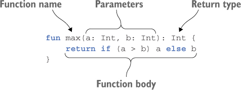
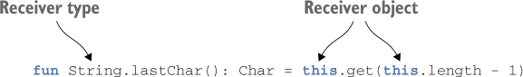
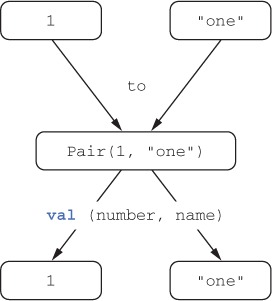
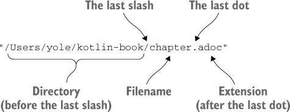
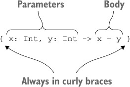

# ___Kotlin___ 👃❌

📖 `kotlin in action`

🔗 <https://www.manning.com/books/kotlin-in-action>

🔗 <https://try.kotlinlang.org>

🔗 <https://www.acornpub.co.kr/book/kotlin-in-action>

---

# 코틀린은 무엇인가? 

코틀린은 JVM, Android, JavaScript and Native를 대상으로 JetBrains에서 개발한 OSS 정적 타입 프로그래밍 언어다.  
코틀린은 __간결__ 하고 __실용적__ 이며, 자바 코드와의 __상호운용성__ (interoperability)을 중시한다.  
현재 자바가 사용 중인 곳이라면 거의 대부분 코틀린은 활용할 수 있다.  
대표적으로 _서버 개발_, _안드로이드 앱 개발_ 등의 분야에서 코틀린을 쓸 수 있다.  
코틀린은 기존 자바 라이브러리나 프레임워크와 함께 잘 작동하며, 성능도 자바와 같은 수준이다.

## 코틀린의 주요 특성

### - 대상 플랫폼: 서버, 안드로이드 등 자바가 실행되는 모든 곳

코틀린의 주목적은 자바 코드를 더 간결하고 생산적이며 안전한 언어로 대체하는 것이다.
- 서버
- 안드로이드 애플리케이션
- 인텔의 멀티OS 엔진(intel Multi-Os Engine)을 사용하면 코틀린을 iOS 디바이스에서 실행 가능  
- 데스크탑 애플리케이션을 작성하고 싶다면 코틀린과 토네이도FX, 자바FX 등을 함께 사용 가능
- 코틀린을 자바스크립트로도 컴파일 가능, 브라우저나 노드에서 실행 가능

### - 정적 타입 지정 언어

__정적 타입 지정__ 이라는 말은 모든 프로그램 구성 요소의 타입을 _컴파일 시점_ 에 알 수 있고, 
프로그램 안에서 객체의 필드나 메소드를 사용할 때마다 _컴파일러가_ 타입을 검증해준다는 뜻  
 
__동적 타입 지정__ 언어에서는 타입과 관계없이 모든 값을 변수에 넣을 수 있고, 메소드나 필드 접근에 대한 검증이 _실행 시점_ 에 일어나며, 그에 따라 코드가 더 짧아지고 데이터 구조를 더 유연하게 생성하고 사용할 수 있다.

코틀린은 정적 타입 지정 언어이다.  
하지만 자바와 달리 코틀린 컴파일러가 변수 타입을 자동으로 유추할 수 있기 때문에 모든 변수의 타입을 직접 명시할 필요가 없다.  

`var x = 1`  

코틀린은 이 변수의 타입이 Int임을 자동으로 알아낸다. 컴파일러가 문맥을 고려해 변수 타입을 결정하는 이런 기능을 __타입 추론(type inference)__ 이라고 부른다.  

> #### 정적 타입 지정의 장점

- __성능__: 실행 시점에 어떤 메소드를 호출할지 알아내는 과정이 필요 없으므로 메소드 호출이 더 빠르다.
- __신뢰성__: 컴파일러가 프로그램의 정확성을 검증하기 때문에 실행 시 프로그램이 오류로 중단될 가능성이 더 적어진다.
- __유지 보수성__: 코드에서 다루는 객체가 어떤 타입에 속하는지 알 수 있기 때문에 처음 보는 코드를 다룰 때도 더 쉽다.
- __도구 지원__: 정적 타입 지정을 활용하면 더 안전하게 리팩토링 할 수 있고, 도구는 더 정확한 코드 완성 기능을 제공할 수 있으며, IDE의 다른 지원 기능도 더 잘 만들 수 있다.

### - 함수형 프로그래밍

> #### 핵심 개념

- __일급 시민인(first-class) 함수__: 함수를 일반 값처럼 다룰 수 있다. 함수를 변수에 저장할 수 있고, 함수를 인자로 다른 함수에 전달할 수 있으며, 함수에서 새로운 함수를 만들어서 반환할 수 있다.
- __불변성(immutability)__: 함수형 프로그래밍에서는 일단 만들어지고 나면 내부 상태가 절대로 바뀌지 않는 불변 객체를 사용해 프로그램을 작성한다.
- __부수 효과(side effect) 없음__: 함수형 프로그래밍에서는 입력이 같으면 항상 같은 출력을 내놓고 다른 객체의 상태를 변경하지 않으며, 함수 외부나 다른 바깥 환경과 상호작용하지 않는 순수 함수를 사용한다.

> #### 장점

- 간결성 - 함수를 값처럼 사용 가능

```kotlin
fun findAlice() = findPerson { it.name == "Alice" }
fun findBob() = findPerson { it.name == "Bob" }
```

- 다중 스레드 사용 시 안전 - 불변 데이터 구조 사용으로 같은 데이터를 여러 스레드가 변경할 수 없음
- 테스트하기 쉽다 - 순수 함수는 준비 코드 없이 독립적으로 테스트 가능

> #### 지원

- 함수 타입을 지원함에 따라 어떤 함수가 다른 함수를 파라미터로 받거나 함수가 새로운 함수를 반환할 수 있다.  
- 람다 식을 지원함에 따라 번거로운 준비 코드(setup code)를 작성하지 않아도 코드 블록을 쉽게 정의하고 여기저기 전달할 수 있다.  
- 데이터 클래스는 불변적인 값 객체를 간편하게 만들 수 있는 구문을 제공한다.  
- 코틀린 표준 라이브러리는 객체와 컬렉션을 함수형 스타일로 다룰 수 있는 API를 제공한다.

## 코틀린 응용

### - 코틀린 서버 프로그래밍

- 브라우저에 HTML 페이지를 돌려주는 웹 애플리케이션
- 모바일 애플리케이션에게 HTTP를 통해 JSON API를 제공하는 백엔드 애플리케이션
- RPC(원격 프로시저 호출) 프로토콜을 통해 서로 통신하는 작은 서비스들로 이뤄진 마이크로서비스

자바 코드와 매끄럽게 상호운용할 수 있다는 점이 코틀린의 큰 장점이다.  

> #### DSL 기능

- HTML 생성 라이브러리
- 영속성 프레임워크
  - Exposed 프레임워크(SQL 데이터베이스)

### - 코틀린 안드로이드 프로그래밍

- 널 포인터 관련 오류 문제를 줄여줌  
- 자바 6와 완전히 호환  
- 코틀린 컴파일러가 생성한 바이트코드는 일반적인 자바 코드와 똑같이 효율적으로 실행된다.  
- 코틀린 표준 라이브러리 함수는 인자로 받은 람다 함수를 인라이닝(inlining)한다.  
- 람다를 사용해도 새로운 객체가 만들어지지 않으므로 객체 증가로 인해 가비지 컬렉션이 늘어나서 프로그램이 자주 멈추는 일도 없다.

## 코틀린의 철학

### - 실용성

- 코틀린은 다른 프로그래밍 언어가 채택한 이미 성공적으로 검증된 해법과 기능에 의존하여 언어의 복잡도가 줄어들고 이미 알고 있는 기존 개념을 통해 더 쉽게 배울 수 있다.  
- 도구 강조  
- IDE의 언어지원  

### - 간결성

- 내용 파악이 쉬워짐  
- 준비 코드(생성자, 설정자, 접근자 등)가 적음  
- 기능이 다양한 표준 라이브러리 제공  
- 람다 지원  
- 생상성 향상

### - 안정성

- JVM 사용(메모리 안전성 보장, 버퍼 오버플로우 방지 등)
- 타입 자동 추론(타입 안정성)
- NullPointerException, ClassCastException 방지

```kotlin
val s: String? = null   <- 널이 될 수 있음
val s2: String = ""     <- 널이 될 수 없음
```

```kotlin
if (value is String)
   println(value.toUpperCase())
```

### - 상호운용성

- 자바 기존 라이브러리 사용 가능
- 자바 코드와 혼합 가능

## 코틀린 코드 컴파일

코틀린 컴파일러는 자바 컴파일러가 자바 소스코드를 컴파일할 때와 마찬가지로 코틀린 소스코드를 분석해서 .class파일을 만들어낸다.  
.class 파일은 개발 중인 애플리케이션의 유형에 맞는 표준 패키징 과정을 거쳐 실행될 수 있다.


코틀린 컴파일러로 컴파일한 코드는 코틀린 런타임 라이브러리에 의존한다.  
런타임 라이브러리에는 코틀린 자체 표준 라이브러리 클래스와 코틀린에서 자바 API의 기능을 확장한 내용이 들어있다.  

---

# 코틀린 기초

## 기본 요소: 함수와 변수

### - Hello, World!

```kotlin
fun main(args: Array<String>) {
    println("Hello, world!")
}
```

- 함수 선언 시 fun 키워드 사용
- 파라미터 이름 뒤에 타입을 쓴다.
- 함수를 최상위 수준에 정의 가능(꼭 클래스 안에 정의할 필요X)
- 세미콜론(;)은 옵션

### - 함수



위 그림은 코틀린 함수의 기본 구조를 보여준다.  
코틀린에서 if는 문장이 아니고 결과를 만드는 식이다.  
자바 3항 연산자 (a > b) ? a : b 식과 비슷하다.
문(statement)과 식(expression)의 차이는 값을 만들어내지 못하는 것과 만들어내는 것의 차이

- 블록이 본문인 함수

```kotlin
fun max(a: Int, b: Int): Int {
    return if (a > b) a else b
}
```

- 식이 본문인 함수

```kotlin
fun max(a: Int, b: Int): Int = if (a > b) a else b
```

```kotlin
// 타입 추론
fun max(a: Int, b: Int) = if (a > b) a else b
```

### - 변수

초기화 식을 사용하지 않고 변수를 선언하려면 변수 타입을 반드시 명시해야 한다.

```kotlin
val answer: Int
answer = 42
```

> #### 변경 가능한 변수와 변경 불가능한 변수

- val - 변경 불가능한 참조를 저장하는 변수다. 자바에서 final 변수에 해당
- var - 변경 가능한 참조다. 자바에서 일반 변수에 해당

```kotlin
var a = 3
val b = 3
a = 4
b = 4       // 컴파일 오류
a = "no a"  // "Error: type mismatch" 컴파일 오류 발생
```

### - 더 쉽게 문자열 형식 지정: 문자열 템플릿

```kotlin
fun main(args: Array<String>) {
    val name = if (args.size > 0) args[0] else "Kotlin"
}
```

변수 앞에 $를 추가해 변수를 문자열 안에 사용 가능  
자바에서 ("Hello, " + name + "!")과 같지만 더 간결하고 효율적

간단한 변수 이름만으로 한정되지 않고, 복잡한 식도 중괄호로 둘러싸서 사용 가능

```kotlin
fun main(args: Array<String>) {
    if (args.size > 0) {
        println("Hello, ${args[0]}!")
    }
}
```

```kotlin
fun main(args: Array<String>) {
    println("Hello, ${if (args.size > 0) args[0] else "someone"}!")
}
```

## 클래스와 프로퍼티

```java
/* 자바 */
public class Person {
    private final String name;
    public Person(String name) {
        this.name = name;
    }
    public String getName() {
        return name;
    }
}
```

```kotlin
class Person(val name: String)
```

### - 프로퍼티

자바에서는 필드와 접근자를 하나로 프로퍼티라고 부른다. 코틀린은 프로퍼티를 언어 기본 기능으로 제공하며, 코틀린 프로퍼티는 자바의 필드와 접근자 메소드를 완전히 대신한다.  

```kotlin
class Person(
    val name: String,
    var isMarried: Boolean
)
```

`val name: String`은 읽기 전용 프로퍼티로, 코틀린은 (비공개) 필드와 필드를 읽는 단순한 (공개) 게터를 만들어낸다.

`var isMarried: Boolean`은 쓸 수 있는 프로퍼티로, 코틀린은 (비공개) 필드, (공개) 게터, (공개) 세터를 만들어낸다.

- 자바에서 Person 클래스를 사용하는 방법

```java
/* 자바 */
Person person = new Person("Bob", true);
person.setMarried(false);
System.out.println(person.getName());
System.out.println(person.isMarried());
```

- 코틀린에서 Person 클래스를 사용하는 방법 

```kotlin
val person = Person("Bob", true)
person.isMarried = false
println(person.name)
println(person.isMarried)
```

코틀린에서는 생성자 호출 시 new 키워드를 사용하지 않는다.  
프로퍼티 이름을 직접 사용해도 코틀린이 자동으로 게터를 호출해준다.

### - 커스텀 접근자

```kotlin
class Rectangle(val height: Int, val width: Int) {
    val isSquare: Boolean
        get() { // 프로퍼티 게터 선언
            return height == width
        }
}
```

```kotlin
class Rectangle(val height: Int, val width: Int) {
    val isSquare: Boolean
        get() = height == width // 이렇게 표현 가능
}
```

### - 코틀린 소스코드 구조: 디렉터리와 패키지

같은 패키지에 속해 있다면 다른 파일에서 정의한 선언일지라도 직접 사용할 수 있다.  
반면 다른 패키지에 정의한 선언을 사용하려면 임포트를 통해 선언을 불러와야 한다.

```kotlin
package geometry.shapes  // 패키지 선언
import java.util.Random // 표준 자바 라이브러리 클래스 임포트
class Rectangle(val height: Int, val width: Int) {
    val isSquare: Boolean
        get() = height == width
}
fun createRandomRectangle(): Rectangle {
    val random = Random()
    return Rectangle(random.nextInt(), random.nextInt())
}
```

코틀린에서는 클래스 임포트와 함수 임포트에 차이가 없으며, 모든 선언을 import 키워드로 가져올 수 있다.

```kotlin
package geometry.example
import geometry.shapes.createRandomRectangle // 이름으로 함수 임포트하기
fun main() {
    println(createRandomRectangle().isSquare)   // "true"가 아주 드물게 출력된다.
}
```

자바에서는 패키지의 구조와 일치하는 디렉터리 계층 구조를 만들고 클래스의 소스코드를 그 클래스가 속한 패키지와 같은 디렉터리에 위치시켜야 한다.


코틀린에서는 여러 클래스를 한 파일에 넣을 수 있고, 파일의 이름도 마음대로 정할 수 있다.


## 선택과 표현의 처리: enum과 when

### - enum

```kotlin
enum class Color {
    RED, ORANGE, YELLOW, GREEN, BLUE, INDIGO, VIOLET
}
```

코틀린에서는 enum class를 사용하지만 자바에서는 enum을 사용한다.  
코틀린에서 enum은 소프트 키워드(soft keyword)라 부르는 존재다.  
enum은 class 앞에 있을 떄는 특별한 의미를 지니지만 다른 곳에서는 이름에 사용할 수 있다.  
반면 class는 키워드이다.  
따라서 class라는 이름을 사용할 수 없으므로 클래스를 표현하는 변수 등을 정의할 때는 clazz나 aClass와 같은 이름을 사용해야 한다.  

자바와 마찬가지로 enum은 단순히 값만 열거하는 존재가 아니다.  
enum 클래스 안에도 프로퍼티나 메소드를 정의할 수 있다.  

- 프로퍼티나 메소드 정의 가능

```kotlin
enum class Color (
    val r: Int, val g: Int, val b: Int
) {
    RED(255, 0, 0), ORANGE(255, 165, 0),
    YELLOW(255, 255, 0), GREEN(0, 255, 0), BLUE(0, 0, 255),
    INDIGO(75, 0, 130), VIOLET(238, 130, 238);  // 세미콜론 필수

    fun rgb() = (r * 256 + b) * 256 + b 
}

>>> println(Color.BLUE.rgb())
```

enum에도 일반적인 클래스와 마찬가지로 생성자와 프로퍼티를 선언한다.  
각 enum 상수를 정의할 떄는 그 상수에 해당하는 프로퍼티 값을 지정해야만 한다.  
이 예제에서는 코틀린에서 유일하게 세미콜론(;)이 필수인 부분을 볼 수 있다.  
enum 클래스 안에 메소드를 정의하는 경우 반드시 enum 상수 목록과 메소드 정의 사이에 세미콜론을 넣어야 한다.

### - when

자바에서 switch문에 해당

```kotlin
fun getMnemonic(color: Color) =
    when (color) {
        Color.RED -> "Richard"
        Color.ORANGE -> "Of"
        Color.YELLOW -> "York"
        Color.GREEN -> "Gave"
        Color.BLUE -> "Battle"
        Color.INDIGO -> "In"
        Color.VIOLET -> "Vain"
    }

>>> println(getMnemonic(Color.BLUE))
```

break 생략 가능

```kotlin
fun getWarmth(color: Color) = when(color) {
    // ,를 사용하여 한 분기 안에 여러 값 사용 가능
    Color.RED, Color.ORANGE, Color.YELLOW -> "warm"
    Color.GREEN -> "neutral"
    Color.BLUE, Color.INDIGO, Color.VIOLET -> "cold"
}

>>> println(getWarmth(Color.ORANGE))
```

```kotlin
import ch02.colors.Color    // 다른 패키지에서 정의한 Color 클래스를 임포트한다.
import ch02.colors.Color.*  // 짧은 이름으로 사용하기 위해 enum 상수를 모두 임포트한다.

fun getWarmth(color: Color) = when(color) {
    RED, ORANGE, YELLOW -> "warm"
    GREEN -> "neutral"
    BLUE, INDIGO, VIOLET -> "cold"
}
```

분기 조건에 상수(enum 상수나 숫자 리터럴)만을 사용할 수 있는 자바 switch와는 달리  
코틀린 when의 분기 조건은 임의의 객체를 허용한다.  

```kotlin
fun mix(c1: Color, c2: Color) =
    /**
     *  when의 분기 조건 부분에 식을 넣을 수 있음
     *  객체 사용 가능
     */
    when(setOf(c1, c2)) {
        setOf(RED, YELLOW) -> ORANGE
        setOf(YELLOW, BLUE) -> GREEN
        setOf(BLUE, VIOLET) -> INDIGO
        else -> throw Exception("Dirty color")
    }

>>> println(mix(BLUE, YELLOW))  // GREEN
```

- 성능 향상

```kotlin
fun mixOptimized(c1: Color, c2: Color) =
    when {
        (c1 == RED && c2 == YELLOW) ||
        (c1 == YELLOW && c2 == RED) ->
            ORANGE
        (c1 == YELLOW && c2 == BLUE) ||
        (c1 == BLUE && c2 == YELLOW) ->
            GREEN
        (c1 == BLUE && c2 == VIOLET) ||
        (c1 == VIOLET && c2 == BLUE) ->
            INDIGO
        else -> throw Exception("Dirty color")
    }
```

- when에 인자가 없으려면 각 분기의 조건이 불리언 결과를 계산하는 식이어야 함

### - 스마트 캐스트: 타입 검사와 타입 캐스트를 조합

```kotlin
interface Expr
class Num(val value: Int): Expr
class Sum(val left: Expr, val right: Expr): Expr
```

(1 + 2) + 4  
eval(Sum(Num(1), Num(2)), Num(4))

```kotlin
fun eval(e: Expr): Int {
    if (e is Num) { // 컴파일러는 e를 Num으로 해석
        val n = e as Num    // as는 명시적 타입 캐스팅
        return n.value
    }
    if (e is Sum) { // 컴파일러는 e를 Sum으로 해석
        return eval(e.right) + eval(e.left)
    }
    throw IllegalArgumentException("Unknown expression")
}
```

- is는 변수 타입을 검사 후 캐스팅
- 자바의 instanceof와 비슷하지만 명시적 캐스팅이 필요 없음
- 프로퍼티는 반드시 val이어야 함

스마트 캐스트는 is로 변수에 든 값의 타입을 검사한 다음에 그 값이 바뀔 수 없는 경우에만 작동한다.  
프로퍼티는 반드시 val이어야 하며, 커스텀 접근자를 사용한 것이어도 안된다.  
val이 아니거나, val이지만 커스텀 접근자를 사용하는 경우에는 해당 프로퍼티에 대한 접근이 항상 같은 값을 내놓는다고 확신할 수 없기 때문이다.

### - 리팩토링: if를 when으로 변경

```kotlin
fun eval(e: Expr): Int =
    if (e is Num) {
        e.value
    } else if (e is Sum) {
        eval(e.right) + eval(e.left)
    } else {
        throw IllegalArgumentException("Unknown expression")
    }
```

- if 중첩 대신 when 사용하기

```kotlin
fun eval(e: Expr): Int =
    when (e) {
        is Num ->
            e.value
        is Sum ->
            eval(e.right) + eval(e.left)
        else ->
            throw IllegalArgumentException("Unknown expression")
    }
```

### - if와 when 분기에서 블록 사용

- 블록의 마지막 문장이 블록 전체의 결과

```kotlin
fun evalWithLogging(e: Expr): Int =
    when (e) {
        is Num -> {
            println("num: ${e.value}")
            e.value
        }
        is Sum -> {
            val left = evalWithLogging(e.left)
            val right = evalWithLogging(e.right)
            println("sum: $left + $right")
            left + right
        }
        else -> throw IllegalArgumentException("Unknown expression")
    }

>>> println(evalWithLogging(Sum(Sum(Num(1), Num(2)), Num(4))))
```

'블록의 마지막 식이 블록의 결과'라는 규칙은 블록이 값을 만들어내야 하는 경우 항상 성립한다.  
나중에 try, catch, 람다식에서 이 규칙이 어떻게 쓰이는지 설명한다.  
하지만 이 규칙은 함수에 대해서는 성립하지 않는다.  
식이 본문인 함수는 블록을 본문으로 가질 수 없고  
블록이 본문인 함수는 내부에 return문이 반드시 있어야 한다.  

## 대상을 이터레이션: while과 for 루프

### - while

```kotlin
while (조건) {
    /*...*/
}

do {
    /*...*/
} while (조건)
```

### - for

코틀린에서는 for문에서 초기값, 증가값, 최종값을 대신하여 범위(range)를 사용한다.

..연산자
: 시작 값과 끝 값 범위의 값

- `val oneToTen = 1..10`

```kotlin
fun fizzBuzz(i: Int) = when {
    i % 15 == 0 -> "FizzBuzz "
    i % 3 == 0 -> "Fizz "
    i % 5 == 0 -> "Buzz"
    else -> "$i "
}

>>> for (i in 1..100) {
...     print(fizzBuzz(i))
... }
1 2 Fizz 4 Buzz Fizz 7 ...

>>> for (i in 100 downTo 1 step 2) {
...     print(fizzBuzz(i))
... }
Buzz 98 Fizz 94 92 FizzBuzz 88 ... 
```

- `100 downTo 1`: 역방향 수열  
- `step 2`: 증가값 2  
- `100 downTo 1 step 2`: 역방향 수열, -2씩 증가  
- `for (x in 0 until size)` == `for (x in 0..size-1)`  

키워드: `..`, `downTo`, `step`, `until`

### - 맵에 대한 이터레이션

```kotlin
val binaryReps = TreeMap<Char, String>()    // 키를 정렬하기 위해 TreeMap을 사용

for (c in 'A'..'F') {   // 'A'부터 'F'까지 반복
    val binary = Integer.toBinaryString(c.toInt())  // 아스키 코드를 2진 표현으로 바꾼다.
    binaryReps[c] = binary
}

for ((letter, binary) in binaryReps) {  // 맵에 대한 이터레이션
    println("$letter = $binary")
}
```

- `binaryReps[c] = binary` == `binaryReps.put(c, binary)`

```kotlin
val list = arrayListOf("10", "11", "1001")
for((index, element) in list.withIndex()) { // 인덱스와 함께 컬렉션을 이터레이션
    println("$index: $element")
}
```

### - in으로 컬렉션이나 범위의 원소 검사

```kotlin
fun isLetter(c: Char) = c in 'a'..'z' || c in 'A'..'Z'
fun isNotDigit(c: Char) = c !in '0'..'9'

>>> println(isLetter('q'))
true
>>> println(isNotDigit('x'))
true
```

- `c in 'a'..'z'` ==  `'a' <= c && c <= 'z'`

```kotlin
for recognize(c: Char) = when (c) {
    in '0'..'9' -> "It's a digit!"
    in 'a'..'z', in 'A'..'Z' -> "It's a letter!"
    else -> "I don't know..."
}

>>> println(recognize('8'))
It's a digit!

>>> println("Kotlin" in "Java".."Scala")    // "Java" <= "Kotlin" && "Kotlin" <= "Scala">
true

>>> println("Kotlin" in setOf("Java", "Scala")) // 이 집합에는 "Kotlin"이 들어있지 않다.
false
```

## 예외 처리

```kotlin
if (percentage !in 0..100) {
    throw IllegalArgumentException(
        "A percentage value must be between 0 and 100: $percentage")
}
```

다른 클래스와 마찬가지로 예외 인스턴스를 만들 때도 new를 붙일 필요가 없다.  
자바와 달리 코틀린의 throw는 식이므로 다른 식에 포함될 수 있다.

```kotlin
val percentage =
    if (number in 0..100)
        number
    else
        throw IllegalArgumentException(
            "A percentage value must be between 0 and 100: $percentage")
```

이 예제에서는  
조건이 참이면 프로그램이 정상 동작해서 percentage변수가 number의 값으로 초기화된다.  
조건이 거짓이면 변수가 초기화되지 않는다.

### - try, catch, finally

```kotlin
fun readNumber(reader: BufferedReader): Int? {  // 함수가 던질 수 있는 예외를 명시할 필요가 없다.
    try {
        val line = reader.readLine()
        return Integer.parseInt(line)
    }
    catch (e: NumberFormatException) {  // 예외 타입을 :의 오른쪽에 쓴다.
        return null
    }
    finally {
        reader.close()
    }
}

>>> val reader = BufferedReader(StringReader("239"))
>>> println(readNumber(reader))
239
```

자바 코드와의 가장 큰 차이는 throws 절이 코드에 없다.  
자바에서는 함수를 작성할 때 함수 선언 뒤에 throws IOException을 붙여야 한다.  
이유는 IOException이 체크 예외(checked exception)이기 때문이다.  
자바에서는 체크 예외를 명시적으로 처리해야 한다.  
어떤 함수가 던질 가능성이 있는 예외나 그 함수가 호출한 다른 함수에서 발생할 수 있는 예외를 모두 catch로 처리해야 하며, 처리하지 않은 예외는 throws 절에 명시해야 한다.

코틀린은 체크 예외와 언체크 예외를 구별하지 않는다.  
코틀린에서는 함수가 던지는 예외를 지정하지 않고 발생한 예외를 잡아내도 되고 잡아내지 않아도 된다.  
실제 자바 프로그래머들이 체크 예외를 사용하는 방식을 고려해 이렇게 코틀린 예외를 설계했다.

위의 예에서 NumberFormatException은 체크 예외가 아니다.  
따라서 자바 컴파일러는 NumberFormatException을 잡아내게 강제하지 않는다.  
그에 따라 실제 실행 시점에 NumberFormatException이 발생하는 모습을 자주 볼 수 있다.  
하지만 입력 값이 잘못되는 경우는 흔히 있는 일이므로 그런 문제가 발생한 경우 부드럽게 다음 단계로 넘어가도록 프로그램을 설계해야 한다는 점에서 이는 불행한 일이다.  
동시에 BufferedReader.class는 IOException을 던질 수 있는데, 그 예외는 체크 예외이르모 자바에서는 반드시 처리해야 한다.  
하지만 실제 스트림을 닫다가 실패하는 경우 특별히 스트림을 사용하는 클라이언트 프로그램이 취할 수 있는 의미 있는 동작은 없다.  
그러므로 이 IOException을 잡아내는 코드는 그냥 불필요하다.  

### - try를 식으로 사용

```kotlin
fun readNumber(reader: BufferedReader) {
    val number = try {
        Integer.parseInt(reader.readLine())
    } catch (e: NumberFormatException) {
        return
    }
    println(number)
}

>>> val reader = BufferedReader(StringReader("not a number"))
>>> readNumber(reader)
```

코틀린의 try는 if, when과 같이 식이다.

```kotlin
fun readNumber(reader: BufferedReader) {
    val number = try {
        Integer.parseInt(reader.readLine())
    } catch (e: NumberFormatException) {
        null
    }
    println(number)
}

>>> val reader = BufferedReader(StringReader("not a number"))
>>> readNumber(reader)
null
```

---

# 함수 정의와 호출

## 컬렉션 만들기

`val set = hashSetOf(1, 7, 53)`  
`val list = arrayListOf(1, 7, 53)`   
`val map = hashMapOf(1 to "one", 7 to "seven", 53 to "fifty-three")`

`to`는 키워드가 아니라 일반 함수

```kotlin
// 자바: getClass()
>>> println(set.javaClass)
class java.util.HashSet
>>> println(list.javaClass)
class java.util.ArrayList
>>> println(map.javaClass)
class java.util.HashMap
```

표준 자바 컬렉션을 활용하여 자바 코드와 상호작용이 훨씬 더 쉽다.

```kotlin
>>> val strings = listOf("first", "second", "fourteenth")
>>> println(strings.last())
fourteenth
>>> val numbers = setOf(1, 14, 2)
>>> println(numbers.max())
14
```

## 함수 호출을 쉽게 만들기

```kotlin
>>> val list = listOf(1, 2, 3)
>>> println(list)   // toString() 호출
[1, 2, 3]
```

자바 컬렉션에는 디폴트 toString 구현이 들어있다(출력 형식 고정..)  
디폴트 구현과 달리 (1; 2; 3)처럼 다르게 표현하고 싶다면??  
코틀린에는 이런 요구 사항을 처리할 수 있는 함수가 표준 라이브러리에 들어있다.

joinToString 함수는 컬렉션의 원소를 StringBuilder의 뒤에 덧붙인다.  
이때 원소 사이에 구분자를 추가하고, StringBuilder의 맨 앞과 맨 뒤에는 접두사와 접미사를 추가한다.

```kotlin
fun <T> joinToString (
    collection: Collection<T>,
    separator: String,
    prefix: String,
    postfix: String
): String {
    val result = StringBuilder(prefix)
    for ((index, element) in collection.withIndex()) {
        if (index > 0) result.append(separator)
        result.append(element)
    }
    result.append(postfix)
    return result.toString()
}

>>> val list = listOf(1, 2, 3)
>>> println(joinToString(list, "; ", "(", ")"))
(1; 2; 3)
```

### - 이름 붙인 인자

함수 호출 부분의 __가독성__ 해결  
함수의 인자들이 어떤 역할을 하는지 구분X

```java
/* 자바 */
joinToString(collection, /* separator */ " ", /* prefix */ " ", /* postfix */ ".");
```

```kotlin
/* 코틀린 */
joinToString(collection, separator = " ", prefix = " ", postfix = ".")
```

함수 호출 시 함수에 전달하는 인자 중 일부(또는 전부)의 이름을 명시할 수 있다.  
하나라도 명시하고 나면 혼동을 막기 위해 그 뒤에 오는 모든 인자는 이름을 꼭 명시하여야 한다.

> #### ⚠️경고 
> 자바로 작성한 코드를 호출할 때는 이름 붙인 인자를 사용할 수 없다.  
따라서 안드로이드 프레임워크나 JDK가 제공하는 함수를 호출할 때도 마찬가지로 이름 붙인 인자를 쓸 수 없다.  
클래스 파일(.class 파일)에 함수 파라미터 정보를 넣는 것은 자바 8이후 추가된 선택적 특징인데,  
코틀린은 JDK 6와 호환된다.  
그 결과 코틀린 컴파일러는 함수 시그니처의 파라미터 이름을 인식할 수 없고,  
호출 시 사용한 인자 이름과 함수 정의의 파라미터 이름을 비교할 수 없다.

### - 디폴트 파라미터 값

자바 일부 클래스에서 오버로딩(overloading)한 메소드가 너무 많아진다는 문제  
함수 선언에서 파라미터의 디폴트 값을 지정할 수 있다.

```kotlin
fun <T> joinToString (
    collection: Collection<T>,
    separator: String = ", ",
    prefix: String = "",
    postfix: String = ""
): String

>>> joinToString(list, ", ", "", "")
1, 2, 3
>>> joinToString(list)
1, 2, 3
>>> joinToString(list, "; ")
1; 2; 3
```

일부 생략 시 뒷부분의 인자들이 생략  
이름 붙은 인자 사용 시 인자 목록의 중간에 있는 인자를 생략, 순서와 관계없이 지정 가능

```kotlin
>>> joinToString(list, postfix = ";", prefix = "# ")
# 1, 2, 3;
```

함수의 디폴트 파라미터 값은 함수를 호출하는 쪽이 아니라 함수 선언 쪽에서 지정된다.  

> #### 디폴트 값과 자바  
> 자바에서는 디폴트 파라미터 값이라는 개념이 없어서 코틀린 함수를 자바에서 호출하는 경우에는 그 코틀린 함수가 디폴트 파라미터 값을 제공하더라도 모든 인자를 명시해야 한다.  
자바에서 코틀린 함수를 자주 호출해야 한다면 자바 쪽에서 좀 더 편하게 코틀린 함수를 호출하고 싶을 것이다.  
그럴 때 @JvmOverloads 애노테이션을 함수에 추가할 수 있다.  
@JvmOverloads를 함수에 추가하면 코틀린 컴파일러가 자동으로 맨 마지막 파라미터로부터 파라미터를 하나씩 생략한 오버로딩한 자바 메소드를 추가해준다.  
예를 들어 joinToString에 @JvmOverloads를 붙이면 다음과 같은 오버로딩한 함수가 만들어진다.  
> ```kotlin
> /* 자바 */
> String joinToString(Collection<T> collection, String separator, String prefix, String postfix);
> String joinToString(Collection<T> collection, String separator, String prefix);
> String joinToString(Collection<T> collection, String separator);
> String joinToString(Collection<T> collection);
> ```
> 각각의 오버로딩한 함수들은 시그니처에서 생략된 파라미터에 대해 코틀린 함수의 디폴트 파라미터 값을 사용한다.

### - 정적인 유틸리티 클래스 없애기: 최상위 함수와 프로퍼티

자바에서는 모든 코드를 클래스 안에 메소드로 작성하여야한다.

join.kt

```kotlin
package strings
fun joinToString(...): String { ... }
```

```java
/* 자바 */
package strings;
public class JoinKt {
    public static String joinToString(...) { ... }
}
```

코틀린 컴파일러가 생성하는 클래스의 이름은 최상위 함수가 들어있던 코틀린 소스 파일의 이름과 대응한다.  
코틀린 파일의 모든 최상위 함수는 이 클래스의 정적인 메소드가 된다.  
따라서 자바에서 joinToString을 호출하기는 쉽다.

```java
/* 자바 */
import strings.JoinKt;
...
JoinKt.joinToString(list, ", ", "", "");
```

> #### 파일에 대응하는 클래스의 이름 변경하기  
> 코틀린 최상위 함수가 포함되는 클래스의 이름을 바꾸고 싶다면 파일에 @JvmName 애노테이션을 추가  
@JvmName 애노테이션은 파일의 맨 앞, 패키지 이름 선언 이전에 위치해야 한다.
> ```kotlin
> @file:JvmName("StringFunctions")    // 클래스 이름을 지정하는 애노테이션
> package strings
> fun joinToString(...): String { ... }
> ```
>
> ```java
> /* 자바 */
> import strings.StringFunctions;
> StringFunctions.joinToString(list, ", ", "", "");
> ```

---

> #### 최상위 프로퍼티

함수와 마찬가지로 프로퍼티도 파일의 최상위 수준에 놓을 수 있다.  

```kotlin
var opCount = 0     // 최상위 프로퍼티 선언
fun performOperation() {
    opCount++       // 최상위 프로퍼티 값 변경
}

fun reportOperationCount() {
    println("Operation performed $opCount times")   // 최상위 프로퍼티 값 읽음
}
```

최상위 프로퍼티를 활용해 상수 추가 가능

`val UNIX_LINE_SEPARATOR = "\n"`

기본적으로 최상위 프로퍼티도 다른 모든 프로퍼티처럼 접근자 메소드를 통해 자바 코드에 노출됨  
(val의 경우 접근자, var의 경우 설정자와 접근자가 생김)  
겉으로는 상수처럼 보이지만, 실제로는 접근자를 사용해야 한다면 자연스럽지 못함  
const 변경자를 추가하면 프로퍼티를 public static final 필드로 컴파일하게 만들 수 있음  
(단, 원시 타입과 String 타입의 프로퍼티만 const로 지정 가능)

`const val UNIX_LINE_SEPARATOR = "\n"`

앞의 코드는 다음 자바 코드와 동등한 바이트코드를 만듬

/* 자바 */  
`public static final String UNIX_LINE_SEPARATOR = "\n";`

## 메소드를 다른 클래스에 추가: 확장 함수와 확장 프로퍼티

__확장 함수__ 는 어떤 클래스의 멤버 메소드인 것처럼 호출할 수 있지만 그 클래스의 밖에 선언된 함수  
확장 함수를 만드려면 추가하려는 함수 이름 앞에 그 함수가 확장할 클래스 이름을 덧붙이기만 하면 된다.

```kotlin
package strings
fun String.lastChar(): Char = this.get(this.length - 1)
```

- __수신 객체 타입(receiver type)__: 확장이 정의될 클래스의 타입  
- __수신 객체(receiver object)__: 그 클래스에 속한 인스턴스 객체



```kotlin
>>> println("Kotlin".lastChar())
n
// String: 수신 객체 타입
// "Kotlin": 수신 객체
```

String 클래스에 새로운 메소드를 추가하는 것과 같다.  
원하는 메소드를 String 클래스에 추가?

```kotlin
package strings
fun String.lastChar(): Char = get(length - 1)
// this 생략 가능
```

하지만 확장 함수 안에서는 클래스 내부에서만 사용할 수 있는 private멤버나 protected멤버를 사용할 수 없다.

### - 임포트와 확장 함수

확장 함수를 사용하기 위해서는 그 함수를 임포트하여야 한다.  

```kotlin
import strings.lastChar
val c = "Kotlin".lastChar()
```

*를 사용한 임포트

```kotlin
import strings.*
val c = "Kotlin".lastChar()
```

as 키워드 사용

```kotlin
import strings.lastChar as last
val c = "Kotlin".last()
```

한 파일 안에서 다른 여러 패키지에 속해있는 이름이 같은 함수를 가져와 사용해야하는 경우 이름을 바꿔서 임포트하면 이름 충돌을 막을 수 있다.

### - 자바에서 확장 함수 호출

내부적으로 확장 함수는 수신 객체를 첫 번째 인자로 받는 정적 메소드다.  
그래서 확장 함수를 호출해도 다른 어댑터 객체나 실행 시점 부가 비용이 들지 않는다.  
확장 함수를 StringUtil.kt 파일에 정의했다면 다음과 같이 호출할 수 있다.

```java
/* 자바 */
char c = StringUtilKt.lastChar("Java");
```

### - 확장 함수로 유틸리티 함수 정의

```kotlin
fun <T> Collection<T>.joinToString(     // Collection<T>에 대한 확장 함수 선언
    separator: String = ", ",
    prefix: String = "",
    postfix: String = ""
): String {
    val result = StringBuilder(prefix)
    for ((index, element) in this.withIndex()) {    // "this"는 수신 객체를 가리킴. 여기서는 T타입의 원소로 이뤄진 컬렉션
        if (index > 0)  result.append(separator)
        result.append(element)
    }
    result.append(postfix)
    return result.toString()
}
>>> val list = listOf(1, 2, 3)
>>> println(list.joinToString(separator = "; ", prefix = " (", postfix = ") "))
(1; 2; 3)
```

원소로 이뤄진 컬렉션에 대한 확장을 만든다.  
이제 joinToString을 마치 클래스의 멤버인 것처럼 호출할 수 있다.

```kotlin
>>> val list = arrayListOf(1, 2, 3)
>>> println(list.joinToString(" "))
1 2 3
```

확장 함수는 단지 정적 메소드 호출에 대한 문법적인 편의일 뿐이다.  
그래서 클래스가 아닌 더 구체적인 타입을 수신 객체 타입으로 지정할 수 있다.  
문자열의 컬렉션에 대해서만 호출할 수 있는 join함수 정의

```kotlin
fun Collection<String>.join(
    separator: String = ", ",
    prefix: String = "",
    postfix: String = ""
) = joinToString(separator, prefix, postfix)
>>> println(listOf("one", "two", "eight").join(" "))
one two eight

// 이 함수를 객체의 리스트에 대해 호출할 수는 없다.
>>> listOf(1, 2, 8).join()
Error: Type mismatch: inferred type is List<Int> but Collection<String> was expected.
```

확장 함수가 정적 메소드와 같은 특징을 가지므로, 확장 함수를 하위 클래스에서 오버라이드할 수는 없다.

### - 확장 함수는 오버라이드할 수 없다

```kotlin
open class View {
    open fun click() = println("View clicked")
}

class Button: View() {  // Button은 View를 확장한다.
    override fun click() = println("Button clicked")
}
```

Button이 View의 하위 타입이기 때문에 View 타입 변수를 선언해도 Button 타입 변수를 그 변수에 대입할 수 있다.  
View 타입 변수에 대해 click과 같은 일반 메소드를 호출했는데, click을 Button 클래스가 오버라이드했다면 실제로는 Button이 오버라이드한 click이 호출된다.  

> 실행 시점에 객체 타입에 따라 동적으로 호출될 대상 메소드를 결정하는 방식을 동적 디스패치(dynamic dispatch)라고 한다.  
반면 컴파일 시점에 알려진 변수 타입에 따라 정해진 메소드를 호출하는 방식은 정적 디스패치(static dispatch)라고 부른다.  
참고로 프로그래밍 언어 용어에서 '정적'이라는 말은 컴파일 시점을 의미하고, '동적'이라는 말은 실행 시점을 의미한다. - 옮긴이

```kotlin
>>> val view: View = Button()
>>> view.click()    // "View"에 저장된 값의 실제 타입에 따라 호출할 메소드가 결정된다.
Button clicked
```

하지만 확장은 이런 식으로 작동하지 않는다.  
확장 함수는 클래스의 일부가 아니다.  
확장 함수는 클래스 밖에 선언된다.  
확장 함수를 호출할 때 _수신 객체로 지정한 변수의 정적 타입_ 에 의해 어떤 확장 함수가 호출될 지 결정되지,  
그 변수에 저장된 객체의 동적인 타입에 의해 확장 함수가 결정되지 않는다.


```kotlin
fun View.showOff() = println("I'm a view!")
fun Button.showOff() = println("I'm a button!")
>>> >>> val view: View = Button()
>>> view.showOff()  // 확장 함수는 정적으로 결정된다.
I'm a view!
```

view가 가리키는 객체의 실제 타입이 Button이지만, 이 경우 view의 타입이 View이기 때문에 무조건 View의 확장 함수가 호출된다.  

확장 함수를 첫 번째 인자가 수신 객체인 정적 자바 메소드로 컴파일한다는 사실을 기억한다면 이런 동작을 쉽게 이해할 수 있다.  
자바도 호출할 정적 함수를 같은 방식으로 __정적__ 으로 결정한다.

```java
/* 자바 */
>>> View view = new Button();
>>> ExtensionsKt.showOff(view); // showOff 함수를 extensions.kt 파일에 정의했다.
I'm a view!
```

위 예제와 같이 확장 함수를 오버라이드할 수 없다.  
코틀린은 호출될 확장 함수를 __정적__ 으로 결정하기 때문이다.

> #### 📝Note  
> 어떤 클래스를 확장한 함수와 그 클래스의 멤버 함수의 이름과 시그니처가 같다면 _확장 함수가 아니라_ ___멤버 함수가 호출___ 된다(멤버 함수의 우선순위가 더 높다).  

### - 확장 프로퍼티

확장 프로퍼티를 사용하면 기존 클래스 객체에 대한 프로퍼티 혁식의 구문으로 사용할 수 있는 API를 추가할 수 있다.  
프로퍼티라는 이름으로 불리기는 하지만 상태를 저장할 적절한 방법이 없기 때문에(기존 클래스의 인스턴스 객체에 필드를 추가할 방법은 없다) 실제로 확장 프로퍼티는 아무 상태도 가질 수 없다.  
하지만 프로퍼티 문법으로 더 짧게 코드를 작성할 수 있어서 편한 경우가 있다.

```kotlin
val String.lastChar: Char
    get() = get(length - 1)
```

확장 함수의 경우와 마찬가지로 확장 프로퍼티도 일반적인 프로퍼티와 같은데, 단지 수신 객체 클래스가 추가됐을 뿐이다.  
뒷받침하는 필드가 없어서 기본 게터 구현을 제공할 수 없으므로 최소한 게터는 꼭 정의해야 한다.  
마찬가지로 초기화 코드에서 계산한 값을 담을 장소가 전혀 없으므로 초기화 코드도 쓸 수 없다.  

StringBuilder에 같은 프로퍼티를 정의한다면 StringBuilder의 맨 마지막 문자는 변경 가능하므로 프로퍼티를 var로 만들 수 있다.

```kotlin
// 변경 가능한 확장 프로퍼티 선언
var StringBuilder.lastChar: Char
    get() = get(length - 1)     // 프로퍼티 게터
    set(value: Char) {
        this.setCharAt(length - 1, value)   // 프로퍼티 세터
    }

// 확장 프로퍼티를 사용하는 방법은 멤버 프로퍼티를 사용하는 방법과 같다.
>>> println("Kotlin".lastChar)
n
>>> val sb = StringBuilder("Kotlin")
>>> sb.lastChar = '!'
>>> println(sb)
Kotlin!
```

자바에서 확장 프로퍼티를 사용하고 싶다면 항상 StringUtilKt.getLastChar("Java")처럼 게터나 세터를 명시적으로 호출하여야 한다.

## 컬렉션 처리: 가변 길이 인자, 중위 함수 호출, 라이브러리 지원

- __vararg 키워드__ 를 사용하면 호출 시 인자 개수가 달라질 수 있는 함수를 정의할 수 있다.
- __중위 함수__ 호출 구문을 사용하면 인자가 하나뿐인 메소드를 간편하게 호출할 수 있다.
- __구조 분해 선언__ 을 사용하면 복합적인 값을 분해해서 여러 변수에 나눠 담을 수 있다.

### - 자바 컬렉션 API 확장

```kotlin
>>> val strings: List<String> = listOf("first", "second", "fourteenth")
>>> strings.last()
fourteenth
>>> val numbers: Collection<Int> = setOf(1, 14, 2)
>>> numbers.max()
14
```

어떻게 자바 라이브러리 클래스의 인스턴스인 컬렉션에 대해 코틀린이 새로운 기능을 추가할 수 있을까?  
-> last와 max는 확장 함수!!

```kotlin
fun <T> List<T>.last(): T { /* 마지막 원소를 반환함 */ }
fun Collection<Int>.max(): Int { /* 컬렉션의 최댓값을 찾음 */ }
```

### - 가변 인자 함수: 인자의 개수가 달라질 수 있는 함수 정의

리스트를 생성하는 함수를 호출할 때 원하는 만큼 많이 원소를 전달할 수 있다.

`val list = listOf(2, 3, 5, 7, 11)`

라이브러리에서 이 함수의 정의를 보면 다음과 같다.

`fun listOf<T>(vararg values: T): List<T> { ... }`

자바의 가변 길이 인자(varargs)는 메소드를 호출할 때 원하는 개수만큼 값을 인자로 넘기면 자바 컴파일러가 배열에 그 값들을 넣어주는 기능이다.  
코틀린의 가변 길이 인자도 비슷하지만 문법이 조금 다르다.  
타입 뒤에 ...을 붙이는 대신 코틀린에서는 파라미터 앞에 ___vararg___ 변경자를 붙인다.  

이미 배열에 들어있는 원소를 가변 길이 인자로 넘길 때도 코틀린과 자바 구문이 다르다.  
자바에서는 배열을 그냥 넘기면 되지만 코틀린에서는 _배열을 명시적으로 풀어서_ 배열의 각 원소가 인자로 전달되게 해야 한다.  
기술적으로는 __스프레드(spread)연산자__ 가 그런 작업을 해준다.  
하지만 실제로는 전달하려는 배열 앞에 *를 붙이기만 하면 된다.

```kotlin
fun main(args: Array<String>) {
    val list = listOf("args: ", *args)  // 스프레드 연산자가 배열의 내용을 펼쳐준다.
    println(list)
}
```

### - 값의 쌍 다루기: 중위 호출과 구조 분해 선언

맵을 만들려면 mapOf 함수를 사용한다.

`val map = mapOf(1 to "one", 7 to "seven", 53 to "fifty-three")`

to는 코틀린 키워드가 아니다.  
__중위 호출(infix call)__ 로 to라는 일반 메소드를 호출한 것이다.  
중위 호출 시에는 수신 객체와 유일한 메소드 인자 사이에 메소드 이름을 넣는다  
(이때 객체, 메소드 이름, 유일한 인자 사이에는 공백이 들어가야 한다)

```kotlin
1.to("one") // "to" 메소드를 일반적인 방식으로 호출함
1 to "one"  // "to" 메소드를 중위 호출 방식으로 호출함
```

인자가 하나뿐인 일반 메소드나 인자가 하나뿐인 확장 함수에 중위 호출을 사용할 수 있다.  
함수를 중위 호출에 사용하게 허용하고 싶으면 infix 변경자를 함수 선언 앞에 추가해야 한다.

```kotlin
infix fun Any.to(other: Any) = Pair(this, other)
```

to 함수는 Pair의 인스턴스를 반환한다.  
Pair는 코틀린 표준 라이브러리 클래스로, 두 원소로 이뤄진 순서쌍을 표현한다.  
실제로 to는 제네릭 함수지만 여기서는 설명을 위해 그런 세부 사항을 생략

Pair의 내용으로 두 변수를 즉시 초기화할 수 있다.

`val (number, name) = 1 to "one"`

이런 기능을 __구조 분해 선언(destructuring declaration)__ 이라고 부른다.

Pair 인스턴스 외 다른 객체에도 구조 분해를 적용할 수 있다.  
예를 들어서 key와 value라는 두 변수를 맵의 원소를 사용해 초기화할 수 있다.

루프에서도 구조 분해 선언을 활용할 수 있다.  
joinToString에서 본 withIndex를 구조 분해 선언과 조합하면 컬렉션 원소의 인덱스와 값을 따로 변수에 담을 수 있다.



```kotlin
for ((index, element) in collection.withIndex()) {
    println("$index: $element")
}
```

to 함수는 확장 함수다.  
to를 사용하면 타입과 관계없이 임의의 순서쌍을 만들 수 있다.  
이는 to의 수신 객체가 제네릭하다는 뜻이다.  
1 to "one", "one" to 1, list to list.size() 등의 호출이 모두 잘 작동한다.  

`for <K, V> mapOf(vararg values: Pair<K, V>): Map<K, V>`

listOf와 마찬가지로 mapOf에도 원하는 개수만큼 인자를 전달할 수 있다.  
하지만 mapOf의 경우에는 각 인자가 키와 값으로 이뤄진 순서쌍이어야 한다.

## 문자열과 정규식 다루기

코틀린 문자열은 자바 문자열과 같다.  
코틀린은 다양한 확장 함수를 제공함으로써 표준 자바 문자열을 더 즐겁게 다루게 해준다.  
자바와 코틀린 API의 차이를 알아보기 위한 첫 번째 예제로 문자열을 구분 문자열에 따라 나누는 작업을 코틀린에서 어떻게 처리하는지 살펴보자.

### -  문자열 나누기

자바에 String의 split 메소드가 있다.  
스택 오버플로우 질문 중에는 "자바 split 메소드로는 점(.)을 이용해 문자열을 분리할 수 없습니다." 라는 질문이 있다.  
"12.345-6.A".split(".")라는 호출의 결과가 [12, 345-6, A] 배열이라고 생각하는 실수를 저지르는 개발자가 많다.  
하지만 자바의 split 메소드는 빈 배열을 반환한다!  
split의 구분 문자열을 실제로는 정규식(regular expression)이기 때문이다.  
따라서 마침표(.)는 모든 문자를 나타내는 정규식으로 해석된다.

코틀린에서는 자바의 split 대신에 여러 가지 다른 조합의 파라미터를 받는 split 확장 함수를 제공함으로써 혼동을 야기하는 메소드를 감춘다.  
정규식을 파라미터로 받는 함수는 String이 아닌 Regex 타입의 값을 받는다.  
따라서 코틀린에서는 split 함수에 전달하는 값의 타입에 따라 정규식이나 일반 텍스트 중 어느 것으로 문자열을 분리하는지 쉽게 알 수 있다.

```kotlin
>>> println("12.345-6.A".split("\\.|-".toRegex()))  // 정규식을 명시적으로 만든다.
[12, 345, 6, A]
```

코틀린 정규식 문법은 자바와 똑같다.  
여기 있는 패턴은 마침표나 대시와 매치된다(정규식 안에서 마침표가 와일드카드wild card 문자가 아닌 문자 자체literal로 쓰이게 하기 위해 마침표를 이스케이프escape 시켰다).  
정규식을 처리하는 API는 표준 자바 라이브러리 API와 비슷하지만 좀 더 코틀린답게 변경됐다.  
예를 들어 코틀린에서는 toRegex 확장 함수를 사용해 문자열을 정규식으로 변환할 수 있다.

```kotlin
>>> println("12.345-6.A".split(".", "-"))   // 여러 구분 문자열을 지정한다.
[12, 345, 6, A]
```

이 경우 "12.345-6.A".split('.', '-')처럼 문자열 대신 문자를 인자로 넘겨도 마찬가지 결과를 볼 수 있다.  
이렇게 여러 문자를 받을 수 있는 코틀린 확장 함수는 자바에 있는 단 하나의 문자만 받을 수 있는 메소드를 대신한다.

### - 정규식과 3중 따옴표로 묶은 문자열



```kotlin
// String 확장 함수를 사용해 경로 파싱하기
fun parsePath(path: String) {
    val directory = path.substringBeforeLast("/")
    val fullName = path.substringAfterLast("/")
    val fileName = fullName.substringBeforeLast(".")
    val extension = fullName.substringAfterLast(".")
    println("Dir: $directory, name: $fileName, ext: $extension")
}
>>> parsePath("/Users/yole/kotlin-book/chapter.adoc")
Dir: /Users/yole/kotlin-book, name: chapter, ext: adoc
```

코틀린에서는 정규식을 사용하지 않고도 문자열을 쉽게 파싱할 수 있다.  
정규식은 강력하기는 하지만 나중에 알아보기 힘든 경우가 많다.  
정규식이 필요한 때에는 코틀린 라이브러리를 사용하면 더 편하다.  

```kotlin
// 경로 파싱에 정규식 사용하기
fun parsePath(path: String) {
    val regex = """(.+)/(.+)\.(.+)""".toRegex()
    val matchResult = regex.matchEntire(path)
    if(matchResult != null) {
        val (directory, filename, extension) = matchResult.destructured
        println("Dir: $directory, name: $filename, ext: $extension")
    }
}
```

3중 따옴표 문자열을 사용해 정규식을 썼다.  
3중 따옴표 문자열에서는 역슬래시(\\)를 포함한 어떤 문자도 이스케이프할 필요가 없다.  
예를 들어 일반 문자열을 사용해 정규식을 작성하는 경우 마침표 기호를 이스케이프하려면 \\\\.라고 써야 하지만, 3중 따옴표 문자열에서는 \\.라고 쓰면 된다.  
패턴 .은 임의의 문자와 매치될 수 있다.  
따라서 첫 번째 그룹인 (.+)는 마지막 슬래시까지 모든 문자와 매치된다.  
이 부분 문자열에는 마지막 슬래시를 제외한 모든 슬래시도 들어간다.  
두 번째 그룹에도 마지막 전까지 모든 문자가 들어간다.  
세 번째 그룹에는 나머지 모든 문자가 들어간다.  


### - 여러 줄 3중 따옴표 문자열

3중 따옴표 문자열을 문자열 이스케이프를 피하기 위해서만 사용하지는 않는다.  
3중 따옴표 문자열에는 줄 바꿈을 표현하는 아무 문자열이나 (이스케이프 없이) 그대로 들어간다.  
따라서 줄 바꿈이 들어있는 프로그램 텍스트를 쉽게 문자열로 만들 수 있다.

```kotlin
val kotlinLogo = """|  //
                   .| //
                   .|/ \"""
>>> println(kotlinLogo.trimMargin("."))
|  //
| //
|/ \
```

여러 줄 문자열(3중 따옴표 문자열)에는 들여쓰기나 줄 바꿈을 포함한 모든 문자가 들어간다.  
보기 좋게 표현하고 싶다면 들여쓰기의 끝부분을 특별한 문자열로 표시하고,  
`trimMargin` 을 사용해 그 문자열과 그 직전의 공백을 제거한다.  
위의 코드에서는 마침표를 들여쓰기 구분 문자열로 사용했다.  

여러 줄 문자열에는 줄 바꿈이 들어가지만 줄 바꿈을 \n과 같은 특수 문자를 사용해 넣을 수는 없다.  
반면에 \를 문자열에 넣고 싶으면 이스케이프할 필요가 없다.  

- `"C:\\Users\\yole\\kotlin-book"` <- 일반 문자열

- `"""C:\Users\yole\kotlin-book"""` <- 3중 따옴표 문자열

3중 따옴표 문자열 안에 문자열 템플릿을 사용할 수도 있다.  
그러나 3중 따옴표 문자열 안에서는 이스케이프를 할 수 없기 때문에 문자열 템플릿의 시작을 표현하는 $를 3중 따옴표 문자열 안에 넣을 수 없다는 문제 발생...  

`val price = """${'$'}99.9"""`

어쩔 수 없이 문자열 템플릿 안에 '$' 문자를 넣어야 한다.  

프로그래밍 시 여러 줄 문자열이 요긴한 분야로 테스트를 꼽을 수 있다.  
테스트에서는 여러 줄의 텍스트 출력을 만들어내는 연산을 실행하고 그 결과를 예상 결과와 비교해야 하는 경우가 자주 있다.  
여러 줄 문자열은 테스트의 예상 출력을 작성할 때 가장 완벽한 해법이다.  

> #### 📝Note  
> 이제 확장 함수가 기존 라이브러리의 API를 확장하고 기존 라이브러리를 새로운 언어에 맞춰 사용할 수 있게 도와주는 강력한 방법임을 알았을 것이다.  
때로 이런 식으로 기존 라이브러리를 새 언어에서 활용하는 패턴을 '라이브러리 알선(Pimp My Library)' 패턴이라 부른다.  
실제로 코틀린 표준 라이브러리 중 상당 부분은 표준 자바 클래스의 확장으로 이뤄졌다.  
젯브레인스가 만든 안코(Anko) 라이브러리(http://github.com/kotlin/anko)도 안드로이드 API를 코틀린에 맞춰 확장한 함수를 제공한다.  
그 외에도 스프링과 같은 여러 주요 서드파디 라이브러리를 코틀린에 맞게 확장해주는 코틀린 커뮤니티가 만든 수많은 라이브러리를 찾아볼 수 있다.  

## 코드 다듬기: 로컬 함수와 확장

많은 개발자들은 좋은 코드의 특징 중 하나는 중복이 없는 것이라 믿는다.  
반복하지 말라(DRY, Don't Repeat Yourself)  
자바 코드를 작성할 때는 DRY 원칙을 피하기가 쉽지 않다.  
많은 경우 메소드 추출(Extract Method) 리팩토링을 적용해서 긴 메소드를 부분부분 나눠서 각 부분을 재활용할 수 있다.  
하지만 그렇게 코드를 리팩토링하면 클래스 안에 작은 메소드가 많아지고 각 메소드 사이의 관계를 파악하기 힘들어서 코드를 이해하기 더 어려워질 수도 있다.  
리팩토링을 진행해서 추출한 메소드를 별도의 내부 클래스(inner class)안에 넣으면 코드를 깔끔하게 조직할 수는 있지만, 불필요한 준비 코드가 늘어난다.  

코틀린에서는 함수에서 추출한 함수를 원 함수 내부에 중첩시킬 수 있다.

흔히 발생하는 코드 중복을 로컬 함수를 통해 어떻게 제거할 수 있는지 살펴보자.  

```kotlin
class User(val id: Int, val name: String, val address: String)
fun saveUser(user: User) {
    if (user.name.isEmpty()) {      // 필드 검증 중복
        throw IllegalArgumentException(
            "Can't save user ${user.id}: empty Name")
    }
    if (user.address.isEmpty()) {   // 필드 검증 중복
        throw IllegalArgumentException(
            "Can't save user ${user.id}: empty Address")
    }
    // user를 데이터베이스에 저장한다.
}
>>> saveUser(User(1, "", ""))
java.lang.IllegalArgumentException: Can't save user 1: empty Name
```

```kotlin
class User(val id: Int, val name: String, val address: String)
fun saveUser(user: User) {
    fun validate(user: User,    // 한 필드를 검증하는 로컬 함수 정의
                 value: String,
                 fieldName: String) {
        if (value.isEmpty()) {
            throw IllegalArgumentException(
                "Can't save user ${user.id}: empty $fieldName")
        }
    }
}
// 로컬 함수를 호출해서 각 필드를 검증
validate(user, user.name, "Name")
validate(user, user.address, "Address")
// user을 데이터베이스에 저장한다.
```

하지만 User 객체를 로컬 함수에게 하나하나 전달해야 한다는 점은 아쉽다.

```kotlin
class User(val id: Int, val name: String, val address: String)
fun saveUser(user: User) {
    fun validate(value: String, fieldName: String) {    // 이제 saveUser 함수의 user 파라미터를 중복 사용하지 않는다.
        if(value.isEmpty()) {
            throw IllegalArgumentException(
                "Can't save user ${user.id}: " +    // 바깥 함수의 파라미터에 직접 접근 가능
                    "empty $fieldName")
        }
    }
    validate(user.name, "Name")
    validate(user.address, "Address")
}
```

더 개선하여 검증 로직을 User 클래스를 확장한 함수로 만들 수도 있다.

```kotlin
class User(val id: Int, val name: String, val address: String)
fun User.validateBeforeSave() {
    fun validate(value: String, fieldName: String) {
        if(value.isEmpty()) {
            throw IllegalArgumentException(
                "Can't save user $id: empty $fieldName")    // User의 프로퍼티를 직접 사용할 수 있다.
        }
    }
    validate(name, "Name")
    validate(address, "Address")
}
fun saveUser(user: User) {
    user.validateBeforeSave()   // 확장 함수 호출
}
```

## 요약

- 코틀린은 자체 컬렉션 클래스를 정의하지 않지만 자바 클래스를 확장해서 더 풍부한 API를 제공한다.
- 함수 파라미터의 디폴트 값을 정의하면 오버로딩한 함수를 정의할 필요성이 줄어든다. 이름붙인 인자를 사용하면 함수의 인자가 많을 때 함수 호출의 가독성을 더 향상시킬 수 있다.
- 코틀린 파일에서 클래스 멤버가 아닌 최상위 함수와 프로퍼티를 직접 선언할 수 있다. 이를 활용하면 코드 구조를 더 유연하게 만들 수 있다.
- 확장 함수와 프로퍼티를 사용하면 외부 라이브러리에 정의된 클래스를 포함해 모든 클래스의 API를 그 클래스의 소스코드를 바꿀 필요 없이 확장할 수 있다. 확장 함수를 사용해도 실행 시점에 부가 비용이 들지 않는다.
- 중위 호출을 통해 인자가 하나 밖에 없는 메소드나 확장 함수를 더 깔끔한 구문으로 호출할 수 있다.
- 코틀린은 정규식과 일반 문자열을 처리할 때 유용한 다양한 문자열 처리 함수를 제공한다.
- 자바 문자열로 표현하려면 수많은 이스케이프가 필요한 문자열의 경우 3중 따옴표 문자열을 사용하면 더 깔끔하게 표현할 수 있다.
- 로컬 함수를 써서 코드를 더 깔끔하게 유지하면서 중복을 제거할 수 있다.

---

# 클래스, 객체, 인터페이스

코틀린의 클래스와 인터페이스는 자바와는 약간 다르다.  
예를 들어 인터페이스에 프로퍼티 선언이 들어갈 수 있다.  
자바와 달리 코틀린 선언은 기본적으로 final이며 public이다.  
게다가 중첩 클래스는 기본적으로 내부 클래스가 아니다.  
즉, 코틀린 중첩 클래스에는 외부 클래스에 대한 참조가 없다.  

## 클래스 계층 정의

### - 코틀린 인터페이스

코틀린 인터페이스 안에는 추상 메소드뿐 아니라 구현이 있는 메소드도 정의할 수 있다.
다만 인터페이스에는 아무런 상태(필드)도 들어갈 수 없다.

```kotlin
interface Clickable {
    fun click()
}
```

이 코드는 click이라는 추상 메소드가 있는 인터페이스를 정의한다.  
이 인터페이스를 구현하는 모든 비추상 클래스(구체적 클래스)는 click에 대한 구현을 제공해야 한다.  

```kotlin
class Button : Clickable {
    override fun click() = println("I was clicked")
}
>>> Button().click
I was clicked
```

자바에서는 extends와 implements 키워드를 사용하지만, 코틀린에서는 클래스 이름 뒤에 콜론(:)을 붙이고 인터페이스와 클래스 이름을 적는 것으로 클래스 확장과 인터페이스 구현을 모두 처리한다.
자바와 마찬가지로 클래스는 인터페이스를 개수 제한 없이 마음대로 구현할 수 있지만, 클래스는 오직 하나만 확장할 수 있다.  

자바와 달리 코틀린에서는 override 변경자를 꼭 사용해야 한다.  
override 변경자는 실수로 상위 클래스의 메소드를 오버라이드하는 경우를 방지해준다.  
만약 상위 클래스 메소드와 시그니처가 같은 메소드를 우연히 하위 클래스에서 선언하는 경우 컴파일이 안되기 때문에 override를 붙이거나 메소드 이름을 바꿔야만 한다.  

인터페이스 메소드도 디폴트 구현을 제공할 수 있다.  
메소드 앞에 default를 붙여야 하는 자바 8과 달리 코틀린에서는 메소드를 특별한 키워드로 꾸밀 필요 없고, 그냥 메소드 본문을 메소드 시그니처 뒤에 추가하면 된다.

```kotlin
interface Clickable {
    fun click()     // 일반 메소드 선언
    fun showOff() = println("I'm clickable!")   // 디폴트 구현이 있는 메소드
}
```

이 인터페이스를 구현하는 클래스는 click에 대한 구현을 제공해야 한다.  
반면 showOff 메소드의 경우 새로운 동작을 정의할 수도 있고, 그냥 정의를 생략해서 디폴트 구현을 사용할 수도 있다.

```kotlin
interface Focusable {
    fun setFocus(b: Boolean) =
        println("I ${if (b) "got" else "lost"} focus.")
    fun showOff() = println("I'm focusable!")
}
```

한 클래스에서 위 두 인터페이스를 함께 구현하면??  
어느 쪽 showOff 메소드가 선택되지 않고 다음과 같은 컴파일러 오류 발생

> The class 'Button' must  
override public open fun showOff() because it inherits  
many implementations of it.

```kotlin
class Button : Clickable, Focusable {
    override fun click() = println("I was clicked")
    override fun showOff() {
        // 이름과 시그니처가 같은 멤버 메소드에 대해 둘 이상의 디폴트 구현이 있는 경우
        // 인터페이스를 구현하는 하위 클래스에서 명시적으로 새로운 구현을 제공해야 한다.
        super<Clickable>.showOff()  // 상위 타입의 이름을 <> 사이에 넣어서 "super"를 지정하면
        super<Focusable>.showOff()  // 어떤 상위 타입의 멤버 메소드를 호출할지 지정할 수 있다.
        
        /* 자바 */
        Clickable.super.showOff()
        Focusable.super.showOff()
    }
}
```

```kotlin
fun main(args: Array<String>) {
    val button = Button()
    button.showOff()
    button.setFocus(true)
    button.click()
}

I'm clickable!
I'm focusable!
I got focus.
I was clicked.
```

> #### 자바에서 코틀린의 메소드가 있는 인터페이스 구현하기
>코틀린은 자바6와 호환되게 설계됐다.  
따라서 인터페이스의 디폴트 메소드를 지원하지 않는다.  
따라서 코틀린은 디폴트 메소드가 있는 인터페이스를 일반 인터페이스와 디폴트 메소드 구현이 정적 메소드로 들어있는 클래스를 조합해 구현한다.  
인터페이스에는 메소드 선언만 들어가며, 인터페이스와 함께 생성되는 클래스에는 모든 디폴트 메소드 구현이 정적 메소드로 들어간다.  
그러므로 디폴트 인터페이스가 포함된 코틀린 인터페이스를 자바 클래스에서 상속해 구현하고 싶다면 코틀린에서 메소드 본문을 제공하는 메소드를 포함하는 모든 메소드에 대한 본문을 작성해야 한다.  
즉, 자바에서는 코틀린의 디폴트 메소드 구현에 의존할 수 없다.

### - open, final, abstract 변경자: 기본적으로 final

자바에서는 final로 명시적으로 상속을 금지하지 않는 모든 클래스를 다른 클래스가 상속할 수 있다.  
취약한 기반 클래스(fragile base class)라는 문제는 하위 클래스가 기반 클래스에 대해 가졌던 가정이 기반 클래스를 변경함으로써 깨져버린 경우에 생긴다.  
어떤 클래스가 자신을 상속하는 방법에 대해 정확한 규칙을 제공하지 않는다면 그 클래스의 클라이언트는 기반 클래스를 작성한 사람의 의도와 다른 방식으로 메소드를 오버라이드할 위험이 있다.  
모든 하위 클래스를 분석하는 것을 불가능하므로 기반 클래스를 변경하는 경우 하위 클래스의 동작이 예기치 않게 바뀔 수도 있다는 면에서 기반 클래스는 '취약'하다.

이 문제를 해결하기 위해 자바 프로그래밍 기법에 대한 책 중 가장 유명한 책인 Joshua Block가 쓴 Effective Java에서는 "상속을 위한 설계와 문서를 갖추거나, 그럴 수 없다면 상속을 금지하라"라는 조언을 한다.  
이는 특별히 하위 클래스에서 오버라이드하게 의도된 클래스와 메소드가 아니라면 모두 final로 만들라는 뜻이다.  

자바의 클래스와 메소드는 기본적으로 상속에 대해 열려있지만  
코틀린의 클래스와 메소드는 기본적으로 final이다.  

어떤 클래스의 _상속을 허용_ 하려면 클래스 앞에 __open 변경자__ 를 붙여야 한다.  
그와 더불어 _오버라이드를 허용_ 하고 싶은 메소드나 프로퍼티의 앞에도 __open 변경자__ 를 붙여야 한다.

```kotlin
open class RichButton : Clickable { // 다른 클래스가 이 클래스를 상속할 수 있다.
    fun disable() {}    // 이 함수는 final이기 때문에 하위 클래스가 이 메소드를 오버라이드할 수 없다.
    open fun animate() {}   // 하위 클래스에서 이 메소드를 오버라이드해도 된다.
    override fun click() {} // 오버라이드한 메소드는 기본적으로 열려있다.
}
```

기반 클래스나 인터페이스의 멤버를 오버라이드하는 경우 그 메소드는 기본적으로 열려있다.  
오버라이드하는 메소드의 구현을 하위 클래스에서 오버라이드하지 못하게 금지하려면 오버라이드하는 메소드 앞에 final을 명시해야 한다.

```kotlin
open class RichButton : Clickable {
    final override fun click() {}   // 오버라이드 금지
}
```

> #### 열린 클래스와 스마트 캐스트
> 클래스의 기본적인 상속 가능 상태를 final로 함으로써 얻을 수 있는 큰 이익은 다양한 경우에 스마트 캐스트가 가능하다는 점이다.  
스마트 캐스트는 타입 검사 뒤에 변경될 수 없는 변수에만 적용 가능하다.  
클래스 프로퍼티의 경우 이는 val이면서 커스텀 접근자가 없는 경우에만 스마트 캐스트를 쓸 수 있다는 의미다.  
이 요구 사항은 또한 프로퍼티가 final 이어야만 한다는 뜻이기도 하다.  
프로퍼티가 final이 아니라면 그 프로퍼티를 다른 클래스가 상속하면서 커스텀 접근자를 정의함으로써 스마트 캐스트의 요구 사항을 깰 수 있다.  
프로퍼티는 기본적으로 final이기 때문에 따로 고민할 필요 없이 대부분의 프로퍼티를 스마트 캐스트에 활용할 수 있다.  
이는 코드를 더 이해하기 쉽게 만든다.

자바처럼 코틀린에서도 클래스를 abstract로 선언할 수 있다.  
abstract로 선언한 추상 클래스는 인스턴스화할 수 없다.  
추상 클래스에는 구현이 없는 추상 멤버가 있기 때문에 하위 클래스에서 그 추상 멤버를 오버라이드해야만 하는게 보통이다.  
_추상 멤버는 항상 열려있기 때문에_ open 변경자를 명시할 필요가 없다.

```kotlin
abstract class Animated {   // 이 클래스는 추상클래스이므로 이 클래스의 인스턴스를 만들 수 없다.
    // 이 함수는 추상 함수이므로 구현이 없다. 하위 클래스에서는 이 함수를 반드시 오버라이드해야 한다.
    abstract fun animate()  
    
    // 추상 클래스에 속했더라도 비추상 함수는 기본적으로 final이지만 원한다면 open으로 오버라이드를 허용할 수 있다.
    open fun stopAnimating() {}
    fun animateTwice() {}
}
```

인터페이스 멤버의 경우 final, open, abstract를 사용하지 않는다.  
인터페이스 멤버는 항상 열려있으며 final로 변경할 수 없다.  
인터페이스 멤버에게 본문이 없으면 자동으로 추상 멤버가 되지만, 그렇더라도 따로 멤버 선언 앞에 abstract 키워드를 덧붙일 필요가 없다.

> #### 클래스 내에서 상속 제어 변경자의 의미
> 변경자 | 이 변경자가 붙은 멤버는... | 설명
> -|-|-
> final | 오버라이드할 수 없음 | 클래스 멤버의 기본 변경자다.
> open | 오버라이드할 수 있음 | 반드시 open을 명시해야 오버라이드할 수 있다.
> abstract | 반드시 오버라이드해야 함 | 추상 클래스의 멤버에만 이 변경자를 붙일 수 있다. 추상 멤버에는 구현이 있으면 안된다.
> override | 상위 클래스나 상위 인스턴스의 멤버를 오버라이드하는 중 | 오버라이드하는 멤버는 기본적으로 열려있다. 하위 클래스의 오버라이드를 금지하려면 final을 명시해야 한다.

### - 가시성 변경자: 기본적으로 공개

internal은 "모듈 내부에서만 볼 수 있음"이라는 뜻이다.  
모듈은 한 번에 한꺼번에 컴파일되는 코틀린 파일들을 의미한다.  

자바에서는 패키지가 같은 클래스를 선언하기만 하면 어떤 프로젝트의 외부에 있는 코드라도 패키지 내부에 있는 패키지 전용 선언에 쉽게 접근할 수 있다.  
그래서 모듈의 캡슐화가 쉽게 깨진다.  

다른 차이는 코틀린에서는 최상위 선언에 대해 private 가시성을 허용한다는 점이다.  
private 가시성인 최상위 선언은 그 선언이 들어있는 파일 내부에서만 사용할 수 있다.  

> #### 코틀린의 가시성 변경자
> 변경자 | 클래스 멤버 | 최상위 선언
> -|-|-
> public(default) | 모든 곳에서 볼 수 있다. | 모든 곳에서 볼 수 있다.
> internal | 같은 모듈 안에서만 볼 수 있다. | 같은 모듈 안에서만 볼 수 있다.
> protected | 하위 클래스 안에서만 볼 수 있다. | (최상위 선언에 적용할 수 없음)
> private | 같은 클래스 안에서만 볼 수 있다. | 같은 파일 안에서만 볼 수 있다.

```kotlin
internal open class TalkativeButton : Focusable {
    private fun yell() = println("Hey!")
    protected fun whisper() = println("Let's talk!")
}
fun TalkativeButton.giveSpeech() {  // 오류: "public" 멤버가 자신의 "internal" 수신 타입인 "TalkativeButton"을 노출함
    yell()  // 오류: "yell"에 접근할 수 없음: "yell"은 "TalkativeButton"의 "private" 멤버임
    whisper()   // 오류: "whisper"에 접근할 수 없음: "whisper"는 "TalkativeButton"의 "protected" 멤버임
}
```

코틀린은 public 함수인 giveSpeech 안에서 그보다 가시성이 더 낮은 타입인 TalkativeButton을 참조하지 못하게 한다.  
이는 어떤 클래스의 기반 타입 목록에 들어있는 타입이나 제네릭 클래스의 타입 파라미터에 들어있는 타입의 가시성은 그 클래스 자신의 가시성과 같거나 더 높아야 하고, 메소드의 시그니처에 사용된 모든 타입의 가시성은 그 메소드의 가시성과 같거나 더 높아야 한다는 더 일반적인 규칙에 해당한다.  

여기서 컴파일 오류를 없애려면 giveSpeech 확장 함수의 가시성을 internal로 바꾸거나,  
TalkativeButton 클래스의 가시성을 public으로 바꿔야 한다.

자바에서는 같은 패키지 안에서 protected 멤버에 접근할 수 있지만,  
코틀린에서는 오직 어떤 클래스나, 그 클래스를 상속한 클래스 안에서만 보인다.  
클래스를 확장한 함수는 그 클래스의 private나 protected 멤버에 접근할 수 없다.

> #### 코틀린의 가시성 변경자와 자바
> 코틀린의 public, protected, private 변경자는 컴파일된 자바 바이트코드 안에서도 그대로 유지된다.
자바에서는 클래스를 private으로 만들 수 없으므로 내부적으로 코틀린은 private 클래스를 패키지-전용 클래스로 컴파일한다.  
>
> 자바에서는 internal에 딱 맞는 가시성이 없다.  
패키지-전용 가시성은 internal과는 전혀 다르다.  
모듈은 보통 여러 패키지로 이뤄지며 서로 다른 모듈에 같은 패키지에 속한 선언이 들어있을 수도 있다.  
따라서 internal 변경자는 바이트코드상에서는 public이 된다.
>
> 코틀린 선언과 그에 해당하는 자바 선언에 이런 차이가 있기 때문에 코틀린에서는 접근할 수 없는 대상을 자바에서 접근할 수 있는 경우가 생긴다.  
예를 들어 다른 모듈에 정의된 internal클래스나 internal 최상위 선언을 모듈 외부의 자바 코드에서 접근할 수 있다.  
또한 코틀린에서 protected로 정의된 멤버를 코틀린 클래스와 같은 패키지에 속한 자바 코드에서는 접근할 수 있다(이는 자바에서 자바 protected 멤버에 접근하는 경우와 같다).
>
> internal로 사용하는 이유 첫 번째는 한 모듈에 속한 어떤 클래스를 모듈 밖에서 상속한 경우 그 하위 클래스 내부의 메소드 이름이 우연히 상위 클래스의 internal 메소드와 같아져서 내부 메소드를 오버라이드하는 경우를 방지하기 위함이고, 두 번째는 실수로 internal 클래스를 모듈 외부에서 사용하는 일을 막기 위함이다.

### - 내부 클래스와 중첩된 클래스: 기본적으로 중첩 클래스

- 중첩 클래스: 바깥쪽 클래스 인스턴스에 대한 접근 권한이 없다. 즉 바깥쪽 클래스에 대한 참조를 저장하지 않는다.

Default
- 자바: 내부 클래스
- 코틀린: 중첩 클래스

```kotlin
interface State: Serializable

interface View {
    fun getCurrentState(): State
    fun restoreState(state: State) {}
}
```

```java
/* 자바 */
public class Button implements View {
    @Override
    public State getCurrentState() {
        return new ButtonState();
    }

    @Override
    public void restoreState(State state) { /*...*/ }

    public class ButtonState implements State { /*...*/ }
}
```

```kotlin
class Button : View {
    override fun getCurrentState(): State = ButtonState()
    override fun restoreState(state: State) { /*...*/ }
    class ButtonState : State { /*...*/ }
}
```

클래스 B 안에 정의된 클래스 A | 자바에서는 | 코틀린에서는
-|-|-
중첩 클래스(바깥쪽 클래스에 대한 참조를 저장하지 않음) | static class A | class A
내부 클래스(바깥쪽 클래스에 대한 참조를 저장함) | class A | inner class A

중첩 클래스 안에는 바깥쪽 클래스에 대한 참조가 없지만 내부 클래스에는 있다.


내부 클래스 Inner 안에서 바깥쪽 클래스 Outer의 참조에 접근하려면 this@Outer라고 써야 한다.

```kotlin
class Outer {
    inner class Inner {
        fun getOuterReference(): Outer = this@Outer
    }
}
```

### - 봉인된 클래스: 클래스 계층 정의 시 계층 확장 제한

```kotlin
interface Expr
class Num(val value: Int) : Expr
class Sum(val left: Expr, val right: Expr) : Expr

fun eval(e: Expr): Int =
    when (e) {
        is Num -> e.value
        is Sum -> eval(e.left) + eval(e.right)
        else -> // 디폴트 분기: "else" 분기가 꼭 있어야 한다.
            throw IllegalArgumentException("Unknown expression")
    }
```

디폴트 분기가 있으면 이런 클래스 계층에 새로운 하위 클래스를 추가하더라도 컴파일러가 when이 모든 경우를 처리하는지 제대로 검사할 수 없다.  
혹 실수로 새로운 클래스 처리를 잊어버렸더라도 디폴트 분기가 선택되기 때문에 심각한 버그가 발생할 수 있다.

상위 클래스에 sealed 변경자를 붙이면 그 상위 클래스를 상속한 하위 클래스 정의를 제한할 수 있다.  
sealed 클래스의 하위 클래스를 정의할 때는 반드시 상위 클래스 안에 중첩시켜야 한다.

```kotlin
sealed class Expr { // 기반 클래스를 sealed로 봉인한다.
    // 기반 클래스의 모든 하위 클래스를 중첩 클래스로 나열한다.
    class Num(val value: Int) : Expr()
    class Sum(val left: Expr, val right: Expr) : Expr()
}

fun eval(e: Expr): Int =
    when (e) {  // "when" 식이 모든 하위 클래스를 검사하므로 별도의 "else" 분기가 없어도 된다.
        is Expr.Num -> e.value
        is Expr.Sum -> eval(e.right) + eval(e.left)
    }
```

when 식에서 sealed 클래스의 모든 하위 클래스를 처리한다면 디폴트 분기가 필요 없다.  
sealed로 표시된 클래스는 자동으로 open이다.


봉인된 클래스는 클래스 외부에 자신을 상속한 클래스를 둘 수 없다.

내부적으로 Expr 클래스는 private 생성자를 가진다.  
그 생성자는 클래스 내부에서만 호출할 수 있다.  
sealed 인터페이스를 정의할 수는 없다.  
봉인된 인터페이스를 만들 수 있다면 그 인터페이스를 자바 쪽에서 구현하지 못하게 막을 수 있는 수단이 코틀린 컴파일러에게 없기 때문이다.

> #### 📝Note  
> 코틀린 1.0에서 sealed는 너무 제약이 심하다.  
예를 들어 모든 하위 클래스는 중첩 클래스여야 하고, 데이터 클래스로 sealed 클래스를 상속할 수도 없다.  
코틀린 1.1부터는 이 제한이 완화됐다.  
봉인된 클래스와 같은 파일의 아무데서나 봉인된 클래스를 상속한 하위 클래스를 만들 수 있고, 데이터 클래스로 하위 클래스를 정의할 수도 있다.

`class Num(val value: Int) : Expr()`

()는 왜 붙어있을까?

## 뻔하지 않은 생성자와 프로퍼티를 갖는 클래스 선언

코틀린은 주 생성자와 부 생성자로 구분한다.  
- 주 생성자: 클래스를 초기화할 때 주로 사용하는 간략한 생성자로, 클래스 본문 밖에서 정의한다.  
- 부 생성자: 클래스 본문 안에서 정의한다.  

또한 코틀린에서는 초기화 블록을 통해 초기화 로직을 추가할 수 있다.

### - 클래스 초기화: 주 생성자와 초기화 블록

보통 클래스의 모든 선언은 중괄호 사이에 들어간다.

`class User(val nickname: String)`

이렇게 클래스 이름 뒤에 오는 괄호로 둘러싸인 코드를 __주 생성자__ 라고 부른다.  
주 생성자는 _생성자 파라미터를 지정_ 하고 그 _생성자 파라미터에 의해 초기화되는 프로퍼티를 정의_ 하는 두 가지 목적에 쓰인다.  

```kotlin
class User constructor(_nickname: String) { // 파라미터가 하나만 있는 주 생성자
    val nickname: String
    init {  // 초기화 블록
        nickname = _nickname
    }
}
```

- `constructor` 키워드: 주 생성자나 부 생성자 정의를 시작할 때 사용
- `init` 키워드: 초기화 블록을 시작

nickname 프로퍼티를 초기화하는 코드를 nickname 프로퍼티 선언에 포함 시킬 수 있어서 초기화 코드를 초기화 블록에 넣을 필요가 없다.  
또한 주 생성자 앞에 별다른 애노테이션이나 가시성 변경자가 없다면 constructor를 생략해도 좋다.

```kotlin
class User(_nickname: String) { // 파라미터가 하나뿐인 주 생성자
    val nickname = _nickname    // 프로퍼티를 주 생성자의 파라미터로 초기화한다.
}
```

```kotlin
class User(val nickname: String)    // "val"은 파라미터에 상응하는 프로퍼티가 생성된다는 뜻이다.
```

생성자 파라미터에도 디폴트 값을 정의할 수 있다.

```kotlin
class User(val nickname: String,    // 생성자 파라미터에 대한 디폴트 값을 제공한다.
           val isSubscribed: Boolean = true)
```

클래스의 인스턴스를 만드려면 new 키워드 없이 생성자를 직접 호출하면 된다.

```kotlin
>>> val hyun = User("현석")
>>> println(hyun.isSubscribed)
true
>>> val gye = User("계영", false)
>>> println(gye.isSubscribed)
false
>>> val hye = User("헤원", isSubscribed = false)
>>> println(hey.isSubscribed)
false
```

> #### 📝Note  
> 모든 생성자 파라미터에 디폴트 값을 지정하면 컴파일러가 자동으로 파라미터 없는 생성자를 만들어준다.  
그렇게 자동으로 만들어진 파라미터 없는 생성자는 디폴트 값을 사용해 클래스를 초기화한다.  
의존관계 주입(DI, Dependency Injection) 프레임워크 등 자바 라이브러리 중에는 파라미터 없는 생성자를 통해 객체를 생성해야만 라이브러리 사용이 가능한 경우가 있는데, 코틀린이 제공하는 파라미터 없는 생성자는 그런 라이브러리와의 통합을 쉽게 해준다.

```kotlin
open class User(val nickname: String) { ... }
class TwitterUser(nickname: String) : User(nickname) { ... }    // 기반 클래스 초기화
```

클래스를 정의할 때 별도로 생성자를 정의하지 않으면 컴파일러가 자동으로 아무 일도 하지 않는 인자가 없는 디폴트 생성자를 만들어준다.  

```kotlin
open class Button   // 인자가 없는 디폴트 생성자가 만들어진다.
```

Button의 생성자는 아무 인자도 받지 않지만, Button 클래스를 상속한 하위 클래스는 반드시 Button 클래스의 생성자를 호출해야 한다.

```kotlin
class RadioButton: Button()
```

기반 클래스의 이름 뒤에는 꼭 괄호가 들어간다.  
반면 인터페이스는 생성자가 없기 때문에 아무 괄호도 없다.  

어떤 클래스를 클래스 외부에서 인스턴스화하지 못하게 막고 싶다면 모든 생성자를 private으로 만들면 된다.  

```kotlin
class Secretive private constructor() {}    // 이 클래스의 주 생성자는 비공개다.
```

외부에서는 Secretive를 인스턴스화할 수 없다.

> #### 비공개 생성자에 대한 대안
> 유틸리티 함수를 담아두는 역할만을 하는 클래스는 인스턴스화할 필요가 없고, 싱글턴인 클래스는 미리 정한 팩토리 메소드 등의 생성 방법을 통해서만 객체를 생성해야 한다.  
자바에서는 이런 더 일반적인 요구 사항을 명시할 방법이 없으므로 어쩔 수 없이 private 생성자를 정의해서 클래스를 다른 곳에서 인스턴스화하지 못하게 막는 경우가 생긴다.  
코틀린은 그런 경우를 언어에서 기본 지원한다.  
정적 유틸리티 함수 대신 최상위 함수를 사용할 수 있고, 싱글턴을 사용하고 싶으면 객체를 선언하면 된다.

### - 부 생성자: 상위 클래스를 다른 방식으로 초기화

생성자가 여럿 필요한 경우가 가끔 있다.

```kotlin
open class View {
    constructor(ctx: Context) {
        // Code
    }
    constructor(ctx: Context, attr: AttributeSet) {
        // Code
    }
}
```

이 클래스는 주 생성자를 선언하지 않고, 부 생성자 2가지 선언한다.  
부 생성자는 `constructor` 키워드로 시작한다.  
필요에 따라 얼마든지 부 생성자를 많이 선언해도 된다.  

```kotlin
class MyButton : View {
    constructor(ctx: Context)
        : super(ctx) {  // 상위 클래스의 생성자를 호출
        // ...
    }
    constructor(ctx: Context, attr: AttributeSet)
        : super(ctx, attr) {    // 상위 클래스의 생성자를 호출
        // ...
    }
}
```

그림에서 화살표는 생성자가 상위 클래스 생성자에게 객체 생성을 위임한다는 사실을 표시한다.


자바와 마찬가지로 생성자에서 this()를 통해 클래스 자신의 다른 생성자를 호출할 수 있다.

```kotlin
class MyButton : View {
    constructor(ctx: Context): this(ctx, MY_STYLE) {    // 이 클래스의 다른 생성자에게 위임
        // ...
    }
    constructor(ctx: Context, attr: AttributeSet): super(ctx, attr) {
        // ...
    }
}
```

MyButton 클래스의 생성자 중 하나가 아래 그림처럼 파라미터의 디폴트 값을 넘겨서 같은 클래스의 다른 생성자(this를 사용해 참조)에게 생성을 위임한다.  
두 번째 생성자는 여전히 super()를 호출한다.


클래스에 주 생성자가 없다면 모든 부 생성자는 반드시 상위 클래스를 초기화 하거나 다른 생성자에게 생성을 위임해야 한다.  

부 생성자가 필요한 주된 이유는 자바 상호운용성이다.  
하지만 부 생성자가 필요한 다른 경우도 있다.  
클래스 인스턴스를 생성할 때 파리미터 목록이 다른 생성 방법이 여럿 존재하는 경우에는 부 생성자를 여럿 둘 수밖에 없다.  

### - 인터페이스에 선언된 프로퍼티 구현

코틀린에서는 인터페이스에 추상 프로퍼티 선언을 넣을 수 있다.

```kotlin
interface User {
    val nickname: String
}
```

이는 User 인터페이스를 구현하는 클래스가 nickname의 값을 얻을 수 있는 방법을 제공해야 한다는 뜻이다.

```kotlin
class PrivateUser(override val nickname: String) : User // 주 생성자에 있는 프로퍼티
class SubscribingUser(val email: String) : User {
    override val nickname: String
        get() = email.substringBefore('@')  // 커스텀 게터
}
class FacebookUser(val accountId: Int) : User {
    override val nickname = getFacebookName(accountId)  // 프로퍼티 초기화 식
}
>>> println(PrivateUser("test@kotlinlang.org").nickname)
test@kotlinlang.org
>>> println(SubscribingUser("test@kotlinlang.org").nickname)
test
```

PrivateUser는 주 생성자 안에 프로퍼티를 직접 선언하는 간결한 구문을 사용한다.  
이 프로퍼티는 User의 추상 프로퍼티를 구현하고 있으므로 override를 표시해야 한다.  

SubscribingUser는 커스텀 게터로 nickname 프로퍼티를 설정한다.

FacebookUser에서는 초기화 식으로 nickname 값을 초기화한다.  

SubscribingUser의 nickname은 매번 호출될 때마다 substringBefore를 호출해 계산하는 커스텀 게터를 활용하고,  
FacebookUser의 nickname은 객체 초기화 시 계산한 데이터를 뒷받침하는 필드에 저장했다가 불러오는 방식을 활용

인터페이스에는 추상 프로퍼티뿐 아니라 게터와 세터가 있는 프로퍼티를 선언할 수도 있다.  
물론 그런 게터와 세터는 뒷받침하는 필드를 참조할 수는 없다(뒷받침하는 필드가 있다면 인터페이스에 상태를 추가하는 셈인데 인터페이스에는 상태를 저장할 수 없다).  

```kotlin
interface User {
    val email: String
    val nickname: String
        get() = email.substringBefore('@')  // 프로퍼티에 뒷받침하는 필드가 없다. 대신 매번 결과를 계산해 돌려준다.
}
```

이 인터페이스에는 추상 프로퍼티인 email과 커스텀 게터가 있는 nickname 프로퍼티가 함께 들어있다.  
하위 클래스는 추상 프로퍼티인 email을 반드시 오버라이드해야 한다.  
반면 nickname은 오버라이드하지 않고 상속할 수 있다.  

### - 게터와 세터에서 뒷받침하는 필드에 접근

값을 저장하는 동시에 로직을 실행할 수 있게 하기 위해서는 접근자 안에서 프로퍼티를 뒷받침하는 필드에 접근할 수 있어야 한다.

```kotlin
class User(val name: String) {
    var address: String = "unspecified"
        set(value: String) {
            println("""
                Address was changed for $name:
                "$field" -> "$value".""".trimIndent())  // 뒷받침하는 필드 값 읽기
            field = value   // 뒷받침하는 필드 값 변경하기
        }
}
>>> val user = User("Alice")
>>> user.address = "Elsenheimerstrasse 47, 80687 Muenchen"  // address의 세터 호출
Address was changed for Alice:
"unspecified" -> "Elsenheimerstrasse 47, 80687 Muenchen".
```

접근자의 본문에서는 field라는 특별한 식별자를 통해 뒷받침하는 필드에 접근할 수 있다.  
게터에서는 field 값을 읽을 수만 있고, 세터에서는 field 값을 읽거나 쓸 수 있다.  

변경 가능 프로퍼티의 게터와 세터 중 한쪽만 직접 정의해도 된다는 점을 기억하라.  
address의 게터는 필드 값을 그냥 반환해주는 뻔한 게터다.  
따라서 게터를 굳이 정의할 필요가 없다.  

컴파일러는 디폴트 접근자 구현을 사용하건 직접 게터나 세터를 정의하건 관계없이 게터나 세터에서 field를 사용하는 프로퍼티에 대해 뒷받침하는 필드를 생성해준다.  
다만 field를 사용하지 않는 커스텀 접근자 구현을 정의한다면 뒷받침하는 필드는 존재하지 않는다(프로퍼티가 val인 경우에는 게터에 field가 없으면 되지만, var인 경우에는 게터나 세터 모두에 field가 없어야 한다).

### - 접근자의 가시성 변경

접근자의 가시성은 기본적으로는 프로퍼티의 가시성과 같다.  
하지만 원한다면 get이나 set 앞에 가시성 변경자를 추가해서 접근자의 가시성을 변경할 수 있다.

```kotlin
class LengthCounter {
    var counter: Int = 0
        private set // 이 클래스 밖에서 이 프로퍼티의 값을 바꿀 수 없다.
    fun addWord(word: String) {
        counter += word.length
    }
}

>>> val lengthCounter = LengthCounter()
>>> lengthCounter.addWord("Hi!")
>>> println(lengthCounter.counter)
3
```

## 컴파일러가 생성한 메소드: 데이터 클래스와 클래스 위임

코틀린 컴파일러가 데이터 클래스에 유용한 메소드를 자동으로 만들어주는 예와 클래스 위임 패턴을 아주 간단하게 쓸 수 있는 예를 살펴보자.

### - 모든 클래스가 정의해야 하는 메소드

자바와 마찬가지로 코틀린 클래스도 toString, equals, hashCode 등을 오버라이드할 수 있다.  

```kotlin
class Client(val name: String, val postalCode: Int)
```

> #### 문자열 표현: toString()

자바처럼 코틀린의 모든 클래스도 인스턴스의 문자열 표현을 얻을 방법을 제공한다.

```kotlin
class Client(val name: String, val postalCode: Int) {
    override fun toString() = "Client(name=$name, postalCode=$postalCode)"
}

>>> val client1 - Client("오현석", 4122)
>>> println(client1)
Client(name=오현석, postalCode=4122)
```

> #### 객체의 동등성: equals()

```kotlin
>>> val client1 = Client("오현석", 4122)
>>> val client2 = Client("오현석", 4122)
>>> println(client1 == client2) // 코틀린에서 == 연산자는 참조 동일성을 검사하지 않고 객체의 동등성을 검사한다. 따라서 == 연산은 equals를 호출하는 식으로 컴파일된다.
false
```

> #### 동등성 연산에 ==를 사용함
> 자바에서는 ==를 원시 타입과 참조 타입을 비교할 때 사용한다.  
원시 타입의 경우 ==는 두 피연산자의 값이 같은지 비교한다(동등성(equality)).  
반면 참조 타입의 경우 ==는 두 피연산자의 주소가 같은지를 비교한다(참조 비교(reference comparision)).  
따라서 자바에서는 두 객체의 동등성을 알려면 equals를 호출해야 한다.  
자바에서는 equals 대신 ==를 호출하면 문제가 될 수 있다는 사실도 아주 잘 알려져 있다.  
>
> 코틀린에서는 ==연산자가 두 객체를 비교하는 기본적인 방법이다.  
==는 내부적으로 equals를 호출해서 객체를 비교한다.  
따라서 클래스가 equals를 오버라이드하면 ==를 통해 안전하게 그 클래스의 인스턴스를 비교할 수 있다.  
참조 비교를 위해서는 === 연산자를 사용할 수 있다.  
=== 연산자는 자바에서 객체의 참조를 비교할 때 사용하는 == 연산자와 같다.

```kotlin
class Client(val name: String, val postalCode: Int) {
    override fun equals(other: Any?): Boolean { // "Any"는 java.lang.Object에 대응하는 클래스로, 코틀린의 모든 클래스의 최상위 클래스다. "Any?"는 널이 될 수 있는 타입이므로 "other"는 null일 수 있다.
        if (other == null || other !is Client)  // "other"가 Client인지 검사한다.
            return false
        return name == other.name &&    // 두 객체의 프로퍼티 값이 서로 같은지 검사한다.
            postalCode == other.postalCode
    }
    override fun toString() = "Client(name=$name, postalCode=$postalCode)"
}
```

client1 == client2는 이제 true를 반환한다.  
하지만 Client 클래스로 더 복잡한 작업을 수행해보면 제대로 작동하지 않는 경우가 있다.

> #### 해시 컨테이너: hashCode()

자바에서는 equals를 오버라이드할 때 반드시 hashCode도 함께 오버라이드해야 한다.  

```kotlin
>>> val processed = hashSetOf(Client("오현석", 4122))
>>> println(processed.contains(Client("오현석", 4122)))
false
```

이는 Client 클래스가 hashCode 메소드를 정의하지 않았기 때문이다.  
JVM 언어에서는 hashCode가 지켜야 하는 "equals()가 true를 반환하는 두 객체는 반드시 같은 hashCode()를 반환해야 한다"는 제약이 있다.

```kotlin
class Client(val name: String, val postalCode: Int) {
    ...
    override fun hashCode(): Int = name.hashCode() * 31 + postalCode
}
```

코틀린 컴파일러는 이 모든 메소드를 자동으로 생성해줄 수 있다.

### - 데이터 클래스: 모든 클래스가 정의해야 하는 메소드 자동 생성

어떤 클래스가 데이터를 저장하는 역할만을 수행한다면 toString, equals, hashCode를 반드시 오버라이드해야 한다.  
이런 메소드를 정의하기는 그리 어렵지 않다.  
data라는 변경자를 클래스 앞에 붙이면 필요한 메소드를 컴파일러가 자동으로 만들어준다.  
data 변경자가 붙은 클래스를 데이터 클래스라고 부른다.  

```kotlin
data class Client(val name: String, val postalCode: Int)
```

이제 Client 클래스는 자바에서 요구하는 모든 메소드를 포함한다.

- 인스턴스 간 비교를 위한 equals
- HashMap과 같은 해시 기반 컨터이너에서 키로 사용할 수 있는 hashCode
- 클래스의 각 필드를 선언 순서대로 표시하는 문자열 표현을 만들어주는 toString

equals와 hashCode는 주 생성자에 나열된 모든 프로퍼티를 고려해 만들어진다.  
생성된 equals 메소드는 모든 프로퍼티 값의 동등성을 확인한다.  
hashCode 메소드는 모든 프로퍼티의 해시 값을 바탕으로 계산한 해시 값을 반환한다.  
이때 주 생성자 밖에 정의된 프로퍼티는 equals나 hashCode를 계산할 때 고려의 대상이 아니다.

> #### 데이터 클래스와 불변성: copy() 메소드

데이터 클래스 인스턴스를 불변 객체로 더 쉽게 활용할 수 있게 코틀린 컴파일러는 한 가지 편의 메소드를 제공한다.  
그 메소드는 객체를 복사하면서 일부 프로퍼티를 바꿀 수 있게 해주는 copy 메소드다.  
복사본은 원본과 다른 생명주기를 가지며, 복사를 하면서 일부 프로퍼티 값을 바꾸거나 복사본을 제거해도 프로그램에서 원본을 참조하는 다른 부분에 전혀 영향을 끼치지 않는다.  

```kotlin
class Client(val name: String, val pastalCode: Int) {
    ...
    fun copy(name: String = this.name,
             postalCode: Int = this.postalCody) =
        Client(name, postalCode)
}

>>> val lee = Client("이계영", 4122)
>>> println(lee.copy(postalCode = 4000))
Client(name=이계영, postalCode=4000)
```

### - 클래스 위임: by 키워드 사용

종종 상속을 허용하지 않는 클래스에 새로운 동작을 추가해야 할 때가 있다.  
이럴 때 사용하는 일반적인 방법이 __데코레이터__ 패턴이다.  
이 패턴의 핵심은 상속을 허용하지 않는 클래스 대신 사용할 수 있는 새로운 클래스(데코레이터)를 만들되 기존 클래스와 같은 인터페이스를 데코레이터가 제공하게 만들고, 기존 클래스를 데코레이터 내부에 필드로 유지하는 것이다.  
이때 새로 정의해야 하는 기능은 데코레이터의 메소드에 새로 정의하고 기존 기능이 그대로 필요한 부분은 데코레이터의 메소드가 기존 클래스의메소드에게 요청을 __전달__ 한다.

이런 접근 방법의 단점은 준비 코드가 상당히 많이 필요하다는 점이다.  

```kotlin
class DelegatingCollection<T> : Collection<T> {
    private val innerList = arrayListOf<T>()
    
    override int size: Int get() = innerList.size
    override fun isEmpty(): Boolean = innerList.isEmpty()
    override fun contains(element: T): Boolean = innerList.contains(element)
    override fun iterator(): Iterator<T> = innerList.iterator()
    override fun containsAll(elements: Collection<T>): Boolean =
        innerList.containsAll(elements)
}
```

인터페이스를 구현할 때 by 키워드를 통해 그 인터페이스에 대한 구현을 다른 객체에 위임 중이라는 사실을 명시할 수 있다.

```kotlin
class DelegatingCollection<T>(
    innerList: Collection<T> = ArrayList<T>()
) : Collection<T> by innerList {}
```

클래스 안에 있던 모든 메소드 정의가 없어졌다.  
컴파일러가 그런 전달 메소드를 자동으로 생성하며 자동 생성한 코드의 구현은 DelegatingCollection에 있던 구현과 비슷하다.

```kotlin
class CountingSet<T>(
    val innerSet: MutableCollection<T> = HashSet<T>()
) : MutableCollection<T> by innerSet {  // MutableCollection의 구현을 innerSet에게 위임한다.
    var objectsAdded = 0

    override fun add(element: T): Boolean { // 위임하지 않고 새로운 구현을 제공한다.
        objectsAdded++
        return innerSet.add(element)
    }

    override fun addAll(c: Collection<T>): Boolean {    // 위임하지 않고 새로운 구현을 제공한다.
        objectsAdded += c.size
        return innerSet.addAll(c)
    }
}

>>> val cset = CountingSet<Int>()
>>> cset.addAll(listOf(1, 1, 2))
>>> println("${cset.objectAdded} objects were added, ${cset.size} remain")
3 objects were added, 2 remain
```

## object 키워드: 클래스 선언과 인스턴스 생성

코틀린에서는 object 키워드를 다양한 상황에서 사용하지만 모든 경우 클래스를 정의하면서 동시에 인스턴스를 생성한다는 공통점이 있다.  

`object` 키워드

- 객체 선언은 싱글턴을 정의하는 방법 중 하나다.
- 동반 객체는 인스턴스 메소드는 아니지만 어떤 클래스와 관련 있는 메소드와 팩토리 메소드를 담을 때 쓰인다. 동반 객체 메소드에 접근할 때는 동반 객체가 포함된 클래스의 이름을 사용할 수 있다.
- 객체 식은 자바의 무명 내부 클래스 대신 쓰인다.

### - 객체 선언: 싱글턴을 쉽게 만들기

객체지향 시스템을 설계하다 보면 인스턴스가 하나만 필요한 클래스가 유용한 경우가 많다.  
자바에서는 보통 클래스의 생성자를 private으로 제한하고 정적인 필드에 그 클래스의 유일한 객체를 저장하는 싱글턴 패턴을 통해 이를 구현한다.  

코틀린은 __객체 선언__ 기능을 통해 싱글턴을 언어에서 기본 지원한다.  
객체 선언은 클래스 선언과 그 클래스에 속한 __단일 인스턴스__ 의 선언을 합친 선언이다.  

```kotlin
object Payroll {
    val allEmployees = arrayListOf<Person>()

    fun calculateSalary() {
        for (person in allEmployees) {
            ...
        }
    }
}
```

객체 선언은 object 키워드로 시작한다.  
객체 선언은 클래스를 정의하고 그 클래스의 인스턴스를 만들어서 변수에 저장하는 모든 작업을 단 한 문장으로 처리한다.  
클래스와 마찬가지로 객체 선언 안에도 프로퍼티, 메소드, 초기화 블록 등이 들어갈 수 있다.  
하지만 생성자는 객체 선언에 쓸 수 없다.  
일반 클래스 인스턴스와 달리 싱글턴 객체는 객체 선언문이 있는 위치에서 생성자 호출 없이 즉시 만들어진다.  
따라서 객체 선언에는 생성자 정의가 필요 없다.  

변수와 마찬가지로 객체 선언에 사용한 이름 뒤에 마침표(.)를 붙이면 객체에 속한 메소드나 프로퍼티에 접근 가능

```kotlin
Payroll.allEmployees.add(Person(...))
Payroll.calculateSalary()
```

객체 선언도 클래스나 인터페이스를 상속할 수 있다.  
프레임워크를 사용하기 위해 특정 인터페이스를 구현해야 하는데, 그 구현 내부에 다른 상태가 필요하지 않은 경우에 이런 기능이 유용하다.  
예를 들어 java.util.Comparator 인터페이스를 살펴보자.  
Comparator 구현은 두 객체를 인자로 받아 그중 어느 객체가 더 큰지 알려주는 정수를 반환한다.  
Comparator 안에는 데이터를 저장할 필요가 없다.  
따라서 어떤 클래스에 속한 객체를 비교할 때 사용하는 Comparator는 보통 클래스마다 하나씩만 있으면 된다.  
따라서 Comparator 인스턴스를 만드는 방법으로는 객체 선언이 가장 좋은 방법이다.

```kotlin
object CaseInsensitiveFileComparator : Comparator<File> {
    override fun compare(file1: File, file2: File): Int {
        return file1.path.compareTo(file2.path, ignoreCase = true)
    }
}

>>> println(CaseInsensitiveFileComparator.compare(
... File("/User"), File("/user")))
0
```

일반 객체를 사용할 수 있는 곳에서는 항상 싱글턴 객체를 사용할 수 있다.  
예를 들어 이 객체를 Comparator를 인자로 받는 함수에게 인자로 넘길 수 있다.

```kotlin
>>> val files = listOf(File("/Z"), File("/a"))
>>> println(files.sortedWith(CaseInsensitiveFileComparator))
[/a, /Z]
```

> #### 싱글턴과 의존관계 주입
> 싱글턴 패턴과 마찬가지 이유로 대규모 소프트웨어 시스템에서는 객체 선언이 항상 적합하지는 않다.  
의존관계가 별로 많지 않은 소규모 소프트웨어에서는 싱글턴이나 객체 선언이 유용하지만, 시스템을 구현하는 다양한 구성 요소와 상호작용하는 대규모 컴포넌트에는 싱글턴이 적합하지는 않다.  
이유는 객체 생성을 제어할 방법이 없고 생성자 파라미터를 지정할 수 없어서다.  
> 
> 생성을 제어할 수 없고 생성자 파라미터를 지정할 수 없으므로 단위 테스트를 하거나 소프트웨어 시스템의 설정이 달라질 때 객체를 대체하거나 객체의 의존관계를 바꿀 수 없다.  
따라서 그런 기능이 필요하다면 자바와 마찬가지로 의존관계 주입 프레임워크(예: 구글 주스(Guice), https://github.com/google/guice)와 코틀린 클래스를 함께 사용해야 한다.

클래스 안에서 객체를 선언할 수도 있다.  
그런 객체도 인스턴스는 단 하나뿐이다.  
예를 들어 어떤 클래스의 인스턴스를 비교하는 Comparator를 클래스 내부에 정의하는게 더 바람직하다.  

```kotlin
data class Person(val name: String) {
    object NameComparator : Comparator<Person> {
        override fun compare(p1: Person, p2: Person): Int = 
            p1.name.compareTo(p2.name)
    }
}

>>> val persons = listOf(Person("Bob"), Person("Alice"))
>>> println(persons.sortedWith(person.NameComparator))
[Person(name=Alice), Person(name=Bob)]
```

> #### 코틀린 객체를 자바에서 사용하기
> 코틀린 객체 선언은 유일한 인스턴스에 대한 정적인 필드가 있는 자바 클래스로 컴파일된다.  
이때 인스턴스 필드의 이름은 항상 INSTANCE다.  
싱글턴 패턴을 자바에서 구현해도 비슷한 필드가 필요하다.  
자바 코드에서 코틀린 싱글턴 객체를 사용하려면 정적인 INSTANCE 필드를 통하면 된다.
>
> ```java
> /* 자바 */
> CaseInsensitiveFileComparator.INSTANCE.compare(file1, file2);
> ```
> 
> 이 예제에서 INSTANCE 필드의 타입은 CaseInsensitiveFileComparator 다.

### - 동반 객체: 팩토리 메소드와 정적 멤버가 들어갈 장소

코틀린 클래스 안에는 정적인 멤버가 없다.  
코틀린 언어는 자바 `static` 키워드를 지원하지 않는다.  
그 대신 코틀린에서는 패키지 수준의 최상위 함수(자바의 정적 메소드 역할을 거의 대신 할 수 있다)와 객체 선언(자바의 정적 메소드 역할 중 코틀린 최상위 함수가 대신할 수 없는 역할이나 정적 필드를 대신할 수 있다)을 활용한다.  
대부분의 경우 최상위 함수를 활용하는 편을 더 권장한다.  
하지만 최상위 함수는 아래 그림처럼 private으로 표시된 클래스 비공개 멤버에 접근할 수 없다.  
그래서 클래스의 인스턴스와 관계없이 호출해야 하지만, 클래스 내부 정보에 접근해야 하는 함수가 필요할 때는 클래스에 중첩된 객체 선언의 멤버 함수로 정의해야 한다.  
그런 함수의 대표적인 예로 팩토리 메소드를 들 수 있다.  


클래스 안에 정의된 객체 중 하나에 companion이라는 특별한 표시를 붙이면 그 클래스의 동반 객체로 만들 수 있다.  
동반 객체의 프로퍼티나 메소드에 접근하려면 그 동반 객체가 정의된 클래스 이름을 사용한다.  
이때 객체의 이름을 따로 지정할 필요가 없다.  
그 결과 동반 객체의 멤버를 사용하는 구문은 자바의 정적 메소드 호출이나 정적 필드 사용 구문과 같아진다.  

```kotlin
class A {
    companion object {
        fun bar() {
            println("Companion object called")
        }
    }
}

>>> A.bar()
Companion object called
```

`private` 생성자를 호출하기 좋은 위치를 알려준다고 했던 사실을 기억하는가?  
바로 동반 객체가 `private` 생성자를 호출하기 좋은 위치다.  
동반 객체는 자신을 둘러싼 클래스의 모든 `private` 멤버에 접근할 수 있다.  
따라서 동반 객체는 바깥쪽 클래스의 `private` 생성자도 호출할 수 있다.  
따라서 동반 객체는 팩토리 패턴을 구현하기 가장 적합한 위치다.  

이제 예제로 부 생성자가 2개 있는 클래스를 살펴보고, 다시 그 클래스를 동반 객체 안에서 팩토리 클래스를 정의하는 방식으로 변경해보자.  

```kotlin
class User {
    val nickname: String
    constructor(email: String) {    // 부 생성자
        nickname = email.substringBefore('@')
    }
    constructor(facebookAccountId: Int) {   // 부 생성자
        nickname = getFacebookName(facebookAccountId)
    }
}
```

이런 로직을 표현하는 더 유용한 방법으로 클래스의 인스턴스를 생성하는 팩토리 메소드가 있다.  

```kotlin
class User private constructor(val nickname: String) {  // 주 생성자를 비공개로 만든다.
    companion object {  // 동반 객체를 선언한다.
        fun newSubscribingUser(email: String) = User(email.substringBefore('@'))
        fun newFacebookUser(accountId: Int) = User(getFacebookName(accountId))
    }
}
```

이 구현에서는 생성자를 통해 User 인스턴스를 만들 수 없고 팩토리 메소드를 통해야만 한다.

클래스 이름을 사용해 그 클래스에 속한 동반 객체의 메소드를 호출할 수 있다.  

```kotlin
>>> val subscribingUser = User.newSubscribingUser("bob@gmail.com")
>>> val facebookUser = User.newFacebookUser(4)
>>> println(subscribingUser.nickname)
bob
```

팩토리 메소드는 매우 유용하다.  
이 예제처럼 목적에 따라 팩토리 메소드 이름을 정할 수 있다.  
게다가 팩토리 메소드는 그 팩토리 메소드가 선언된 클래스의 하위 클래스 객체를 반환할 수도 있다.  
예를 들어 SubscribingUser와 FacebookUser 클래스가 따로 존재한다면 그때그때 필요에 따라 적당한 클래스의 객체를 반환할 수 있다.  
또 팩토리 메소드는 생성할 필요가 없는 객체를 생성하지 않을 수도 있다.  
예를 들어 이메일 주소별로 유일한 User 인스턴스를 만드는 경우 팩토리 메소드가 이미 존재하는 인스턴스에 해당하는 이메일 주소를 전달받으면 새 인스턴스를 만들지 않고 캐시에 있는 기존 인스턴스를 반환할 수 있다.  
하지만 클래스를 확장해야만 하는 경우에는 동반 객체 멤버를 하위 클래스에서 오버라이드할 수 없으므로 여러 생성자를 사용하는 편이 더 나은 해법이다.  

### - 동반 객체를 일반 객체처럼 사용

동반 객체는 클래스 안에 정의된 일반 객체다.  
따라서 동반 객체에 이름을 붙이거나, 동반 객체가 인터페이스를 상속하거나, 동반 객체 안에 확장 함수와 프로퍼티를 정의할 수 있다.  
예를 들어 회사의 급여 명부를 제공하는 웹 서비스를 만든다고 가정하자.  
서비스에서 사용하기 위해 객체를 JSON으로 직렬화하거나 역직렬화해야 한다.  
직렬화 로직을 동반 개게 안에 넣을 수 있다.

```kotlin
class Person(val name: String) {
    companion object Loader {   // 동반 객체에 이름을 붙인다.
        fun fromJson(jsonText: String) : Person = ...
    }
}

// 두 가지 모두 제대로 fromJSON을 호출할 수 있다.
>>> person = Person.Loader.fromJSON("{name: 'Dmitry'}")
>>> person.name
Dmitry
>>> person2 = Person.fromJSON("{name: 'Brent'}")
>>> person2.name
Brent
```

대부분의 경우 클래스 이름을 통해 동반 객체에 속한 멤버를 참조할 수 있으므로 객체의 이름을 짓느라 고심할 필요가 없다.  
하지만 필요하다면 `companion object Loader` 같은 방식으로 동반 객체애도 이름을 붙일 수 있다.  
특별히 이름을 지정하지 않으면 동반 객체 이름은 자동으로 `Companion`이 된다.

> #### 동반 객체에서 인터페이스 구현

다른 객체 선언과 마찬가지로 동반 객체도 인터페이스를 구현할 수 있다.  
인터페이스를 구현하는 동반 객체를 참조할 때 객체를 둘러싼 클래스의 이름을 바로 사용할 수 있다.  

시스템에 Person을 포함한 다양한 타입의 객체가 있다고 가정하자.  
이 시스템에서는 모든 객체를 역직렬화를 통해 만들어야 하기 때문에 모든 타입의 객체를 생성하는 일반적인 방법이 필요하다.  
이를 위해 JSON을 역직렬화하는 JSONFactory 인터페이스가 존재한다.  

```kotlin
interface JSONFactory<T> {
    fun fromJSON(jsonText: String): T
}
class Person(val name: String) {
    companion object : JSONFactory<Person> {
        override fun fromJSON(jsonText: String): Person = ...   // 동반 객체가 인터페이스를 구현한다.
    }
}
```

이제 JSON으로부터 각 원소를 다시 만들어내는 추상 팩토리가 있다면 Person 객체를 그 팩토리에게 넘길 수 있다.  

```kotlin
fun loadFromJSON<T>(factory: JSONFactory<T>): T {
    ...
}
loadFromJSON(Person)    // 동반 객체의 인스턴스를 함수에 넘긴다.
```

여기서 동반 객체가 구현한 JSONFactory의 인스턴스를 넘길 때 Person 클래스의 이름을 사용했다는 점에 유의하라.

> #### 코틀린 동반 객체와 정적 멤버
> 클래스의 동반 객체는 일반 객체와 비슷한 방식으로, 클래스에 정의된 인스턴스를 가리키는 정적 필드로 컴파일된다.  
동반 객체에 이름을 붙이지 않았다면 자바 쪽에서 `Companion`이라는 이름으로 그 참조에 접근할 수 있다.  
>
> ```java
> /* 자바 */
> Person.Companion.fromJSON("...");
> ```
> 
> 동반 객체에게 이름을 붙였다면 `Companion` 대신 그 이름이 쓰인다.  
>
> 때로 자바에서 사용하기 위해 코틀린 클래스의 멤버를 정적인 멤버로 만들어야 할 필요가 있다.  
그런 경우 @JvmStatic 애노테이션을 코틀린 멤버에 붙이면 된다.  
정적 필드가 필요하다면 @JvmField 애노테이션을 최상위 프로퍼티나 객체에서 선언된 프로퍼티 앞에 붙인다.  
이 기능은 자바와의 상호운용성을 위해 존재하며, 정확히 말하자면 코틀린 핵심 언어가 제공하는 기능은 아니다.  
코틀린에서도 자바의 정적 필드나 메소드를 사용할 수 있다.  
그런 경우 자바와 똑같은 구문을 사용한다.  

> #### 동반 객체 확장

확장 함수를 사용하면 코드 기반의 다른 곳에서 정의된 클래스의 인스턴스에 대해 새로운 메소드를 정의할 수 있음을 보였다.  
그렇다면 자바의 정적 메소드나 코틀린의 동반 객체 메소드처럼 기존 클래스에 대해 호출할 수 있는 새로운 함수를 정의하고 싶다면 어떻게 해야 할까?  
클래스에 동반 객체가 있으면 그 객체 안에 함수를 정의함으로써 클래스에 대해 호출할 수 있는 확장 함수를 만들 수 있다.  
더 구체적으로 C라는 클래스 안에 동반 객체가 있고 그 동반 객체(`C.Companion`) 안에 func를 정의하면 외부에서 func()를 `C.func()`로 호출할 수 있다.  

예를 들어 앞에서 살펴본 Person의 관심사를 좀 더 명확히 분리하고 싶다고 하자.  
Person 클래스는 핵심 비지니스 로직 모듈의 일부다.  
하지만 그 비지니스 모듈이 특정 데이터 타입에 의존하기를 원치는 않는다.  
따라서 역직렬화 함수를 비즈니스 모듈이 아니라 클라이언트/서버 통신을 담당하는 모듈 안에 포함시키고 싶다.  
확장 함수를 사용하면 이렇게 구조를 잡을 수 있다.  
다음 예제에서는 이름 없이 정의된 동반 객체를 가리키기 위해 동반 객체의 기본 이름인 `Companion`을 사용했다.  

```kotlin
// 비즈니스 로직 모듈
class Person(val firstName: String, val lastName: String) {
    companion object {  // 비어있는 동반 객체를 선언한다.
    }
}

// 클라이언트/서버 통신 모듈
fun Person.Companion.fromJSON(json: String): Person {   // 확장 함수를 선언한다.
    ...
}

val p = Person.fromJSON(json)
```

마치 동반 객체 안에서 fromJSON 함수를 정의한 것처럼 fromJSON을 호출할 수 있다.  
하지만 실제로 fromJSON은 클래스 밖에서 정의한 확장 함수다.  
다른 보통 확장 함수처럼 fromJSON도 클래스 멤버 함수처럼 보이지만, 실제로는 멤버 함수가 아니다.  
여기서 동반 객체에 대한 확장 함수를 작성할 수 있으려면 원래 클래스에 동반 객체를 꼭 선언해야 한다는 점에 주의하라.  
설령 빈 객체라도 동반 객체가 꼭 있어야 한다.  

### - 객체 식: 무명 내부 클래스를 다른 방식으로 작성

`object` 키워드를 싱글턴과 같은 객체를 정의하고 그 객체에 이름을 붙일 때만 사용하지는 않는다.  
__무명 객체__ 를 정의할 때도 `object` 키워드를 쓴다.  
무명 객체는 자바의 무명 내부 클래스를 대신한다.  
예를 들어 자바에서 흔히 무명 내부 클래스로 구현하는 이벤트 리스너를 코틀린에서 구현해보자.  

```kotlin
window.addMouseListner(
    object : MouseAdapter() {  // MouseAdapter를 확장하는 무명 객체를 선언한다.
        override fun mouseClicked(e: MouseEvent) {  // MouseAdapter의 메소드를 오버라이드한다.
            // ...
        }
        override fun mouseEntered(e: MouseEvent) {  // MouseAdapter의 메소드를 오버라이드한다.
            // ...
        }
    }
)
```

사용한 구문은 객체 선언에서와 같다.  
한 가지 유일한 차이는 객체 이름이 빠졌다는 점이다.  
객체 식은 클래스를 정의하고 그 클래스에 속한 인스턴스를 생성하지만, 그 클래스나 인스턴스에 이름을 붙이지는 않는다.  
이런 경우 보통 함수를 호출하면서 인자로 무명 객체를 넘기기 때문에 클래스와 인스턴스 모두 이름이 필요하지 않다.  
하지만 객체에 이름을 붙여야 한다면 변수에 무명 객체를 대입하면 된다.  

```kotlin
val listener = object : MouseAdapter() {
    override fun mouseClicked(e: MouseEvent) { ... }
    override fun mouseEntered(e: MouseEvent) { ... }
}
```

한 인터페이스만 구현하거나 한 클래스만 확장할 수 있는 자바의 무명 내부 클래스와 달리 코틀린 무명 클래스는 여러 인터페이스를 구현하거나 클래스를 확장하면서 인터페이스를 구현할 수 있다.  

> #### 📝Note
> 객체 선언과 달리 무명 객체는 싱글턴이 아니다.  
객체 식이 쓰일 때마다 새로운 인스턴스가 생성된다.

자바의 무명 클래스와 같이 객체 식 안의 코드는 그 식이 포함된 함수의 변수에 접근할 수 있다.  
하지만 자바와 달리 final이 아닌 변수도 객체 식 안에서 사용할 수 있다.  
따라서 객체 식 안에서 그 변수의 값을 변경할 수 있다.  
예를 들어 어떤 윈도우가 호출된 횟수를 리스너에서 누적하게 만들 수 있다.  

```kotlin
fun countClicks(window: Window) {
    var clickCount = 0  // 로컬 변수 정의
    window.addMouseListener(object : MouseAdapter() {
        override fun mouseClicked(e: MouseEvent) {
            clickCount++    // 로켤 변수의 값 변경
        }
    })
}
```

> #### 📝Note
> 객체 식은 무명 객체 안에서 여러 메소드를 오버라이드해야 하는 경우에 훨씬 더 유용하다.  
메소드가 하나뿐인 인터페이스(Runnable 등의 인터페이스가 그렇다)를 구현해야 한다면 코틀린의 SAM 변환(함수 리터럴(function literal)을 변환해 SAM으로 만듦) 지원을 활용하는 편이 낫다.  
SAM 변환을 사용하려면 무명 객체 대신 함수 리터럴(람다(lambda))을 사용해야 한다.  

## 요약

- 코틀린의 인터페이스는 자바 인터페이스와 비슷하지만 디폴트 구현을 포함할 수 있고, 프로퍼티도 포함할 수 있다.
- 모든 코틀린 선언은 기본적으로 final이며 public이다.
- 선언이 final이 되지 않게 만드려면(상속과 오버라이딩이 가능하게 하려면) 앞에 open을 붙여야 한다.
- internal 선언은 같은 모듈 안에서만 볼 수 있다.
- 중첩 클래스는 기본적으로 내부 클래스가 아니다. 바깥쪽 클래스에 대한 참조를 중첩 클래스 안에 포함시키려면 inner 키워드를 중첩 클래스 선언 앞에 붙여서 내부 클래스로 만들어야 한다.
- sealed 클래스를 상속하는 클래스를 정의하려면 반드시 부모 클래스 정의 안에 중첩(또는 내부) 클래스로 정의해야 한다.
- 초기화 블록과 부 생성자를 활용해 클래스 인스턴스를 더 유연하게 초기화할 수 있다.
- field 식별자를 통해 프로퍼티 접근자(게터와 세터) 안에서 프로퍼티의 데이터를 저장하는 데 쓰이는 뒷받침하는 필드를 참조할 수 있다.
- 데이터 클래스를 사용하면 컴파일러가 equals, hashCode, toString, copy 등의 메소드를 자동으로 생성해준다.
- 클래스 위임을 사용하면 위임 패턴을 구현할 때 필요한 수많은 성가신 준비 코드를 줄일 수 있다.
- 객체 선언을 사용하면 코틀린답게 싱글턴 클래스를 정의할 수 있다.
- (패키지 수준 함수와 프로퍼티 및 동반 객체와 더불어) 동반 객체는 자바의 정적 메소드와 필드를 대신한다.
- 동반 객체도 다른(싱글턴) 객체와 마찬가지로 인터페이스를 구현할 수 있다. 외부에서 동반 객체에 대한 확장 함수와 프로퍼티를 정의할 수 있다.
- 코틀린의 객체 식은 자바의 무명 내부 클래스를 대신한다. 하지만 코틀린 객체 식은 여러 인스턴스를 구현하거나 객체가 포함된 영역에 있는 변수의 값을 변경할 수 있는 등 자바 무명 내부 클래스보다 더 많은 기능을 제공한다.

---

# 람다로 프로그래밍

람다 식 또는 람다는 기본적으로 다른 함수에 넘길 수 있는 작은 코드 조각을 뜻한다.  
람다를 사용하면 쉽게 공통 코드 구조를 라이브러리 함수로 뽑아낼 수 있다.  

## 람다 식과 멤버 참조

### - 람다 소개: 코드 블록을 함수 인자로 넘기기

"이벤트가 발생하면 이 핸들러를 실행하자"나 "데이터 구조의 모든 원소에 이 연산을 적용하자"와 같은 생각을 코드로 표현하기 위해 일련의 동작을 변수에 저장하거나 다른 함수에 넘겨야 하는 경우가 자주 있다.  
예전에 자바에서는 무명 내부 클래스를 통해 이런 목적을 달성했다.  
무명 내부 클래스를 사용하면 코드를 함수에 넘기거나 변수에 저장할 수 있기는 하지만 상당히 번거롭다.  

이와 달리 함수형 프로그래밍에서는 함수를 값처럼 다루는 접근 방법을 택함으로써 이 문제를 해결한다.  
클래스를 선언하고 그 클래스의 인스턴스를 함수에 넘기는 대신 함수형 언어에서는 함수를 직접 다른 함수에 전달할 수 있다.  

```java
/* 자바 */
button.setOnClickListener(new onClickListener() {
    @Override
    public void onClick(View view) {
        /* 클릭 시 수행할 동작 */
    }
});
```

무명 내부 클래스를 선언하느라 코드가 번잡스러워졌다.  
이와 비슷한 작업을 많이 수행해야 하는 경우 그런 번잡함은 난잡함으로 변해 개발자를 괴롭힌다.  
클릭 시 벌어질 동작을 간단히 기술할 수 있는 표기법이 있다면 이런 불필요한 코드를 제거할 수 있을 것이다.  

```kotlin
button.setOnClickListener { /* 클릭 시 수행할 동작 */ }
```

이 코틀린 코드는 앞에서 살펴본 자바 무명 내부 클래스와 같은 역할을 하지만 훨씬 더 간결하고 읽기 쉽다.  

### - 람다와 컬렉션

코드에서 중복을 제거하는 것은

```kotlin
fun findTheOldest(people: List<Person>) {
    var maxAge = 0  // 가장 많은 나이를 저장한다.
    var theOldest: Person? = null   // 가장 연장자인 사람을 저장한다.
    for (person in people) {
        if (person.age > maxAge) {  // 현재까지 발견한 최연장자보다 더 나이가 많은 사람을 찾으면 최댓값을 바꾼다.
            maxAge = person.age
            theOldest = person
        }
    }
    println(theOldest)
}

>>> val people = listOf(Person("Alice", 29), Person("Bob", 31))
>>> findTheOldest(people)
Person(name=Bob, age=31)
```

```kotlin
>>> val people = listOf(Person("Alice", 29), Person("Bob", 31))
>>> println(people.maxBy { it.age })    // 나이 프로퍼티를 비교해서 값이 가장 큰 원소 찾기
Person(name=Bob, age=31)
```

```kotlin
people.maxBy(Person::age)
```

### - 람다 식의 문법

람다는 값처럼 여기저기 전달할 수 있는 동작의 모음이다.  
람다를 선언해서 변수에 저장할 수도 있다.  
하지만 함수에 인자로 넘기면서 바로 람다를 정의하는 경우가 대부분



코틀린 람다 식은 항상 중괄호로 둘러싸여 있다.   
인자 목록 주변에 괄호가 없다.
화살표가 인자 목록과 람다 본문을 구분해준다.  

람다 식을 변수에 저장할 수 있다.  
람다가 저장된 변수를 다른 읿반 함수와 마찬가지로 다룰 수 있다(변수 이름 뒤에 괄호를 놓고 그 안에 필요한 인자를 넣어서 람다를 호출할 수 있다).

```kotlin
>>> val sum = { x: Int, y: Int -> x + y }
>>> println(sum(1,2))   // 변수에 저장된 람다를 호출
3
```

람다 식을 직접 호출해도 된다.

```kotlin
>>> { println(42) }
```

하지만 밑의 코드가 더 보기 좋다.
이렇게 코드의 일부분을 블록으로 둘러싸 실행할 필요가 있다면 run을 사용

```kotlin
>>> run { println(42) } // 람다 본문에 있는 코드를 실행
42
```

실행 시점에 코틀린 람다 호출에는 아무 부가 비용이 들지 않으며, 프로그램의 기본 구성요소와 비슷한 성능을 낸다.  

```kotlin
>>> val people = listOf(Person("Alice", 29), Person("Bob", 31))
>>> println(people.maxBy { it.age })
Person(name=Bob, age=31)
```

위 코드를 정식으로 람다식을 작성하면

```kotlin
people.maxBy({ p:Person -> p.age })
```

중괄호 안에 있는 코드는 람다 식이고 그 람다 식을 maxBy 함수에 넘긴다.  
람다 식은 Person 타입의 값을 인자로 받아서 인자의 age를 반환한다.  

하지만 이 코드는 번잡하다.  
우선 구분자가 너무 많이 쓰여서 가독성이 떨어진다.  
그리고 컴파일러가 문맥으로부터 유추할 수 있는 인자 타입을 굳이 적을 필요는 없다.  
마지막으로 인자가 단 하나뿐인 경우 굳이 인자에 이름을 붙이지 않아도 된다.  

개선을 해보자.  
코틀린에는 함수 호출 시 맨 뒤에 있는 인자가 람다 식이라면 그 람다를 괄호 밖으로 빼낼 수 있다는 문법 관습이 있다.  

```kotlin
people.maxBy() { p: People -> p.age }
```

람다가 어떤 함수의 유일한 인자이고 괄호 뒤에 람다를 썼다면 호출 시 빈 괄호를 없애도 된다.  

```kotlin
people.maxBy { p: People -> p.age }
```

람다가 함수의 유일한 인자라면 괄호 없이 람다를 바로 쓰기 원할 것이다.  
인자가 여럿 있는 경우에는 람다를 밖으로 빼낼 수도 있고 람다를 괄호 안에 유지해서 함수의 인자임을 분명히 할 수도 있다.  
둘 이상의 람다를 인자로 받는 함수라고 해도 인자 목록의 맨 마지막 람다만 밖으로 뺄 수 있다.  
따라서 그런 경우에는 괄호를 사용하는 일반적인 함수 호출 구문을 사용하는 편이 낫다.  

```kotlin
>>> val people = listOf(Person("이몽룡", 29), Person("성춘향", 31))
>>> val names = people.joinToString(separator = " ", transform = { p: Person -> p.name })
>>> println(names)
이몽룡 성춘향
```

이 함수 호출에서 함수를 괄호 밖으로 뺀 모습은 다음과 같다.

```kotlin
people.joinToString(" ") { p: Person -> p.name }
```

처음 코드는 이름 붙은 인자를 사용해 람다를 넘김으로써 람다를 어떤 용도로 쓰는지 더 명확히 했다.  
다음 코드는 더 간결하지만 람다의 용도를 분명히 알아볼 수는 없다.  

컴파일러는 람다 파라미터의 타입도 추론할 수 있다.  

```kotlin
people.maxBy { p: People -> p.age } // 파라미터 타입을 명시
people.maxBy { p -> p.age } // 파라미터 타입을 생략(컴파일러가 추론)
```

maxBy 함수의 경우 파라미터의 타입은 항상 컬렉션 원소 타입과 같다.  
컴파일러는 여러분이 Person 타입의 객체가 들어있는 컬렉션에 대해 maxBy를 호출한다는 사실을 알고 있으므로 람다의 파라미터도 Person이라는 사실을 이해할 수 있다.  

람다의 파라미터 이름을 디폴트 이름인 it으로 바꾸면 람다 식을 더 간단하게 만들 수 있다.  
람다의 파라미터가 하나뿐이고 그 타입을 컴파일러가 추론할 수 있는 경우 it을 바로 쓸 수 있다.

```kotlin
people.maxBy { it.age } // "it"은 자동 생성된 파라미터 이름이다.
```

람다 파라미터 이름을 따로 지정하지 않은 경우에만 it이라는 이름이 자동으로 만들어진다.

> #### 📝Note
> it을 사용하는 관습은 코드를 아주 간단하게 만들어준다.  
하지만 이를 남용하면 안된다.  
특히 람다 안에 람다가 중첩되는 경우 각 람다의 파라미터를 명시하는 편이 낫다.  
파라미터를 명시하지 않으면 각각의 it이 가리키는 파라미터가 어떤 람다에 속했는지 파악하기 어려울 수 있다.  
문맥에서 람다 파라미터의 의미나 파라미터의 타입을 쉽게 알 수 없는 경우에도 파라미터를 명시적으로 선언하면 도움이 된다.  

람다를 변수에 저장할 때는 파라미터의 타입을 추론할 문맥이 존재하지 않는다.  
따라서 파라미터 타입을 명시해야 한다.  

```kotlin
>>> val getAge = { p: Person -> p.age }
>>> people.maxBy(getAge)
```

본문이 여러 줄로 이뤄진 경우 본문의 맨 마지막에 있는 식이 람다의 결과 값이 된다.

```kotlin
>>> val sum = { x: Int, y: Int ->
        println("Computing the sum of $x and $y...")
        x + y
    }
>>> println(sum(1,2))
```

### - 현재 영역에 있는 변수에 접근

